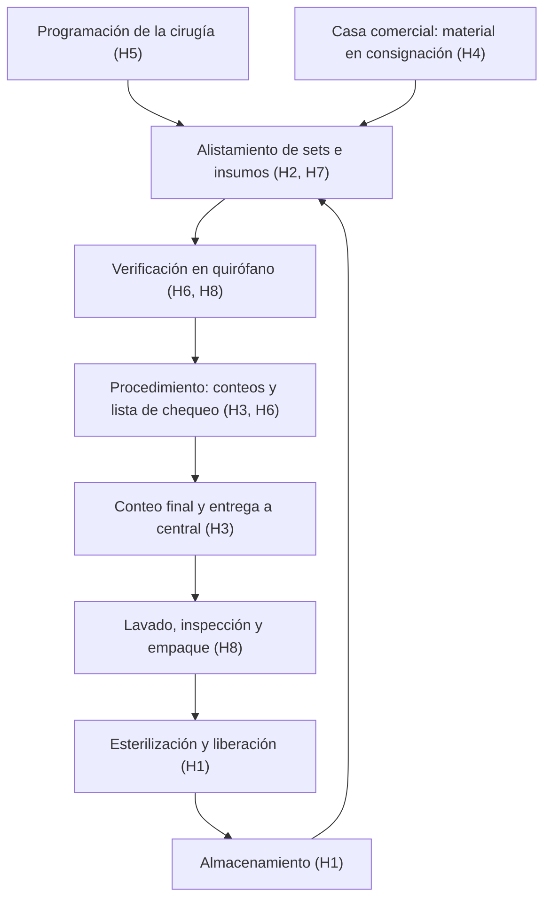

---
tags:
  - hackathon/healthbyte
  - plan
  - investigacion
aliases:
  - Plan de investigación HealthByte
fecha: 2026-09-30
estado: borrador
---

Plan de la fase previa del hackathon de la Universidad Libre: investigar problemas
reales de la instrumentación quirúrgica en la Costa Caribe colombiana, elegir uno con
evidencia y dejar listos los insumos del pitch. Complementa [[consideraciones]].

> [!warning] Regla de la fase
> Todo lo que está en la sección de hipótesis es **por validar**. En el pitch no va
> ninguna cifra ni ningún problema sin fuente (documento, dato público o entrevista).
> Primero el problema, luego la solución: no se diseña producto hasta cerrar la fase.

## 1. Equipo y roles

Somos cinco: cuatro estudiantes de Ingeniería de Sistemas y una de Instrumentación
Quirúrgica. Faltan las carreras de tres integrantes y el nombre de la quinta persona.

| Integrante | Carrera | Rol en el proyecto |
| --- | --- | --- |
| Martha Lucía Castro Olivo | por confirmar | por asignar |
| Leonardo Alfonso Barraza Cantillo | Ingeniería de Sistemas | por asignar |
| Georgy Daniel Muñoz Utria | por confirmar | por asignar |
| Luis Felipe Gómez Duque | por confirmar | por asignar |
| (quinta integrante) | por confirmar | por asignar |

Qué hace cada rol **en esta fase** (los roles vienen de [[consideraciones]]):

| Rol | Responsabilidad en la investigación |
| --- | --- |
| Instrumentador(a) quirúrgico(a) | Experta de dominio. Depura y completa las hipótesis, valida el vocabulario de la guía de entrevista y abre contactos (docentes, sitios de práctica, colegas). |
| Ingeniero de requisitos | Lidera la guía de entrevista y la síntesis. Redacta la ficha del problema y los requerimientos iniciales. |
| Arquitecto y desarrollo de software | Normativa técnica (datos, dispositivos médicos, interoperabilidad), benchmark técnico, proceso AS-IS y viabilidad del MVP. |
| Diseñador UX/UI | Observación, mapa de actores y *journey* del usuario. Después de la fase: identidad visual. |
| Marketing y ventas | Encuesta y cifras para el gancho, benchmark comercial (precios, competidores) e hipótesis de modelo de negocio. |

## 2. Datos del hackathon por confirmar

- [ ] Fecha y hora del pitch final y de las entregas intermedias
- [ ] Reto o eje temático oficial (¿abierto o con retos definidos?)
- [ ] Criterios de evaluación del jurado y su peso
- [ ] Qué hay que entregar: prototipo funcional, mockup, documento, video
- [ ] Si se pueden mostrar datos de entrevistas a instituciones o hace falta aval
- [ ] Si «HealthByte» queda como nombre definitivo

## 3. Preguntas de investigación

**General.** ¿Qué problemas del ejercicio de la instrumentación quirúrgica en las IPS
de la Costa Caribe son frecuentes, tienen impacto medible (seguridad del paciente,
tiempo o dinero) y se pueden atender con una solución tecnológica viable y sostenible?

**Específicas.**

1. ¿En qué etapas del ciclo perioperatorio y del instrumental se concentran los fallos?
2. ¿Cómo se registran y controlan hoy esas etapas (papel, Excel, software) y qué consecuencias tiene?
3. ¿Qué exige la normativa colombiana y dónde está la brecha entre lo exigido y lo que se hace?
4. ¿Qué soluciones existen ya y por qué no se usan en la región?
5. ¿Quién sufre el problema, quién decide la compra y quién pagaría por resolverlo?

## 4. Mapa del dominio

Ciclo del instrumental y del procedimiento. Entre paréntesis, las hipótesis de la
sección 5 que tocan cada etapa. Sirve también como proceso AS-IS para la parte de
arquitectura empresarial.

Transversales: formación del instrumentador (H9) y brecha regional (H10).

## 5. Hipótesis de problemáticas (por validar)

Punto de partida para discutir con la integrante de Instrumentación, que debe
descartar, corregir y añadir. El ángulo tecnológico es solo una pista; no se decide
nada hasta la priorización.

| # | Problemática hipotética | Por qué importaría | Ángulo tecnológico posible |
| --- | --- | --- | --- |
| H1 | Trazabilidad débil del instrumental: los ciclos de esterilización se registran en papel y no se puede saber qué set se usó con qué paciente. | Ante una infección de sitio operatorio o una falla del esterilizador no hay forma rápida de rastrear. | Código QR o Data Matrix por set; registro móvil del ciclo. |
| H2 | Sets incompletos o mal ensamblados: faltan piezas o llegan equivocadas y se nota al abrir el set. | Retrasos con el paciente anestesiado, reprocesos y dependencia de la memoria del personal. | Listas digitales de contenido por set; verificación asistida por foto. |
| H3 | Conteo quirúrgico manual (gasas, compresas, agujas, instrumental) en tablero u hoja, con discrepancias. | Riesgo de cuerpo extraño retenido; radiografías y tiempo extra cuando el conteo no cuadra. | Registro digital del conteo; visión por computador para contar. |
| H4 | Material en consignación (osteosíntesis, prótesis) que llega tarde, incompleto o sin tiempo para esterilizarse, y cuyo consumo se reporta mal. | Cancelaciones, riesgo de esterilidad y errores de facturación (glosas) entre IPS y casa comercial. | Flujo digital de solicitud, recepción y consumo del material. |
| H5 | Cancelaciones o retrasos de cirugías programadas por causas logísticas (instrumental no disponible, esterilización a destiempo). | Quirófano ocioso, costo alto y pacientes reprogramados. | Tablero de disponibilidad del instrumental frente a la programación. |
| H6 | Lista de verificación de cirugía segura diligenciada como trámite, en papel y auditada después. | Pierde su efecto preventivo; la auditoría consume horas. | Lista digital con verificación en tiempo real e indicadores. |
| H7 | Preferencias de cada cirujano (instrumental, suturas, posición) que solo conocen los instrumentadores veteranos. | Errores y demoras con personal nuevo, rotación o estudiantes. | Fichas de preferencia digitales y compartidas. |
| H8 | Instrumental desgastado o dañado que se detecta en plena cirugía, sin historial por pieza. | Riesgo intraoperatorio y reposición reactiva y costosa. | Historial de uso y mantenimiento por pieza o por set. |
| H9 | Formación: los estudiantes deben reconocer cientos de instrumentos y sets con acceso limitado a quirófano y simulación. | Curva de aprendizaje larga; errores en las prácticas. | App de estudio y reconocimiento de instrumental con visión por computador. |
| H10 | Brecha regional: IPS de municipios de la Costa con menos tecnología, conectividad intermitente y menos personal profesional. | Lo que funciona en Barranquilla o Cartagena puede no servir en el resto de la región. | Diseño *offline-first* y de bajo costo. |

**Criterio de validación.** Una hipótesis queda validada si aparece de forma
espontánea en al menos 3 entrevistas, o si al menos el 40 % de la encuesta la reporta
con frecuencia semanal o mayor, y además la respalda al menos una fuente secundaria.

## 6. Investigación secundaria

### Normativa colombiana (verificar vigencia y modificaciones)

| Norma | Para qué nos sirve |
| --- | --- |
| Ley 784 de 2002 | Reglamenta el ejercicio profesional de la instrumentación quirúrgica: funciones y alcance del rol. |
| Resolución 2183 de 2004 | Manual de buenas prácticas de esterilización: qué registros y controles se exigen. |
| Resolución 3100 de 2019 | Habilitación de servicios: estándares de cirugía y esterilización. |
| Resolución 256 de 2016 | Sistema de información para la calidad: indicadores obligatorios (verificar el de cancelación de cirugía). |
| Resolución 4816 de 2008 | Programa Nacional de Tecnovigilancia: eventos adversos con dispositivos médicos. |
| Decreto 4725 de 2005 | Régimen de dispositivos médicos: saber si el software propuesto caería en esa categoría. |
| Política de Seguridad del Paciente (MinSalud, 2008) y paquetes instruccionales | Buenas prácticas en cirugía que las IPS deben aplicar. |
| Ley 2015 de 2020 | Historia clínica electrónica interoperable, si la solución se integra con ella. |
| Ley 1581 de 2012 | Protección de datos personales: condiciona el diseño y el trabajo de campo. |
| OMS, Lista de verificación de la seguridad de la cirugía (2009) | Estándar internacional de referencia. |

### Datos públicos

- **REPS**: IPS con servicios quirúrgicos y de esterilización habilitados en Atlántico,
  Bolívar, Magdalena, Cesar, Córdoba, Sucre y La Guajira. Sirve para dimensionar el
  mercado y elegir a quién entrevistar.
- **SISPRO / RIPS**: volumen de procedimientos quirúrgicos por departamento.
- **Observatorio de Calidad en Salud (MinSalud)**: indicadores de la Resolución 256,
  como la cancelación de cirugía programada.
- **INS**: boletines de infecciones asociadas a la atención en salud, incluida la de
  sitio operatorio.
- **INVIMA**: reportes de tecnovigilancia.
- **datos.gov.co**: conjuntos de datos complementarios.

### Literatura

- Bases: SciELO, Redalyc, LILACS/BVS, PubMed, Google Scholar y repositorios de
  tesis de programas de instrumentación quirúrgica de la región.
- Gremio: Colegio Colombiano de Instrumentación Quirúrgica (publicaciones y eventos).
- Búsquedas sugeridas:
  - `"instrumentación quirúrgica" AND Colombia AND (problemas OR retos)`
  - `"central de esterilización" AND trazabilidad`
  - `("oblito" OR "cuerpo extraño retenido") AND cirugía AND Colombia`
  - `"cancelación de cirugía" AND (Barranquilla OR Cartagena OR Caribe)`
  - `"retained surgical items" AND incidence`
  - `"surgical count" AND discrepancy`
  - `"loaner instruments" AND "sterile processing"`

### Soluciones existentes (benchmark)

Referencias para comparar; verificar si están en Colombia y cuánto cuestan:

- Trazabilidad de instrumental y esterilización: T-DOC (Getinge), SPM (Steris), Censitrac.
- Conteo de gasas y compresas: SurgiCount (Stryker), RF Assure (Medtronic).
- Apps educativas de instrumental quirúrgico (revisar tiendas de apps).
- Startups o desarrollos colombianos (buscar en convocatorias de MinCiencias e iNNpulsa).

La pregunta clave: **¿por qué las IPS de la región no usan estas soluciones?**
(costo en dólares, hardware RFID, integración, conectividad, capacitación). En esa
respuesta suele estar la oportunidad.

## 7. Trabajo de campo

### A quién entrevistar

| Perfil | Meta | Cómo llegar |
| --- | --- | --- |
| Instrumentadores en ejercicio (IPS pública y privada) | 3 a 4 | Red de la integrante de Instrumentación, egresados |
| Jefe o coordinador de central de esterilización | 1 a 2 | Sitios de práctica (convenios docencia-servicio) |
| Coordinación de cirugía, enfermería jefe o calidad y seguridad del paciente | 1 | Sitios de práctica |
| Docentes del programa de Instrumentación Quirúrgica | 1 a 2 | Universidad Libre |
| Representante de casa comercial de osteosíntesis | 1 (opcional) | Contactos de los instrumentadores |
| Cirujano | 1 (opcional) | Docentes |
| Estudiantes de Instrumentación en práctica | encuesta | Grupos del programa |

Mínimo viable: **6 entrevistas y 20 respuestas de encuesta**. Ajustar cuando se
conozca el calendario.

### Guía de entrevista (20 a 30 minutos)

Principio: preguntar por **hechos pasados**, no por opiniones sobre una idea
(enfoque de *The Mom Test*, Rob Fitzpatrick). No presentar ninguna solución durante
la entrevista.

1. Cuéntame un día normal de trabajo, desde que llega la programación hasta que termina la cirugía.
2. ¿Cuándo fue la última vez que algo salió mal, o casi, por instrumental, insumos o conteo? ¿Qué pasó exactamente?
3. ¿Qué tarea te quita más tiempo del que debería?
4. ¿Cómo se registra hoy el conteo, la esterilización o el material en consignación? ¿En papel, Excel o software? ¿Quién lo revisa?
5. ¿Con qué frecuencia pasa eso (por semana o por mes)? ¿Qué consecuencia tiene en tiempo, dinero o riesgo para el paciente?
6. ¿Han intentado resolverlo? ¿Qué funcionó y qué no?
7. Si pudieras cambiar una sola cosa de tu trabajo, ¿cuál sería?
8. ¿Quién decide la compra de tecnología en tu institución? ¿Quién pagaría por resolver esto?
9. ¿A quién más debería entrevistar?

### Encuesta (5 minutos, Google Forms)

- Perfil: rol, tipo de IPS (pública o privada, nivel de complejidad), ciudad y años de experiencia.
- Por cada hipótesis H1 a H10: con qué frecuencia la vive (nunca, mensual, semanal, diaria).
- Tiempo perdido estimado por cirugía a causa de esos problemas.
- Herramientas que usa hoy para registrar y controlar.
- Disposición a usar una app en el quirófano o en la central.

Las respuestas de frecuencia dan las cifras del pitch, por ejemplo: «X de cada 10
instrumentadores de la región reportan sets incompletos al menos una vez por semana».

### Ética y datos

- Consentimiento verbal informado al inicio de cada entrevista; grabar solo con permiso.
- Anonimizar a los entrevistados con códigos (E01, E02…) y no nombrar instituciones
  al hablar de errores sin su autorización.
- No recolectar datos de pacientes ni de historias clínicas (Ley 1581 de 2012).
- Nada de fotos, audio o video dentro del quirófano sin autorización de la institución.

## 8. Priorización del problema

Cada integrante puntúa de 1 a 5 las hipótesis validadas; se promedia y se pondera.

| Criterio | Peso |
| --- | --- |
| Impacto en la seguridad del paciente | 25 % |
| Frecuencia y evidencia (datos y testimonios) | 20 % |
| Viabilidad de un MVP demostrable en el hackathon | 20 % |
| Modelo de negocio claro (quién paga y por qué) | 15 % |
| Pertinencia para la Costa Caribe | 10 % |
| Diferenciación frente a lo que ya existe | 10 % |

## 9. Entregables de la fase

- [ ] **Ficha del problema**, con esta plantilla:
      «[Actor] en [contexto] necesita [necesidad] porque [evidencia]. Hoy lo resuelve
      con [alternativa actual] y eso le cuesta [métrica]».
- [ ] **1 a 3 cifras verificables con fuente** para el gancho y la moraleja del pitch.
- [ ] **Mapa de actores**: usuario, cliente (quien paga), decisor y beneficiario (el paciente).
- [ ] **Hipótesis de modelo de negocio** para validar con la pregunta 8 de la entrevista.
      Candidatas: suscripción B2B por quirófano a IPS, licencia educativa para
      universidades, piloto por convenio docencia-servicio, servicio a casas comerciales.
- [ ] **Requerimientos iniciales**: funcionales, no funcionales y restricciones normativas.
- [ ] **Proceso AS-IS** de la etapa elegida (insumo de arquitectura empresarial).
- [ ] **Banco de fuentes** con enlaces, más entrevistas anonimizadas y resultados de la encuesta.

## 10. Cronograma

Días relativos al arranque; ajustar cuando se confirme la fecha del pitch.

| Bloque | Días | Qué se hace |
| --- | --- | --- |
| 0. Arranque | D0 | Asignar roles, confirmar los datos del hackathon y repartir hipótesis y fuentes. |
| 1. Secundaria | D1 a D3 | Normativa, datos públicos, literatura y benchmark. La integrante de Instrumentación depura las hipótesis. Se preparan la guía y la encuesta. |
| 2. Campo | D3 a D7 | Entrevistas y difusión de la encuesta. |
| 3. Síntesis | D8 a D9 | Agrupar hallazgos, aplicar el criterio de validación y la matriz de priorización. |
| 4. Cierre | D10 | Ficha del problema, requerimientos iniciales e insumos del pitch. |

## 11. Del hallazgo al pitch

| Parte del pitch | Qué aporta la investigación |
| --- | --- |
| Gancho | Una historia real de entrevista o una cifra con fuente. |
| Calentamiento | Contexto regional: IPS, volumen quirúrgico y brecha frente a lo que exige la norma. |
| Clímax | La solución, que se diseña después de esta fase, respondiendo al problema elegido. |
| Moraleja | Métricas de impacto esperado, calculadas con la línea base de la investigación. |

La identidad visual, la arquitectura y el diseño de la solución arrancan cuando esté
cerrada la ficha del problema.
