---
tags:
  - hackathon/healthbyte
  - requisitos
  - srs
fecha: 2026-10-01
version: 1.0
estado: borrador para validación con Instrumentación Quirúrgica
norma: ISO/IEC/IEEE 29148:2018
---

# Especificación de Requisitos de Software (SRS)

## HealthByte: tablero inteligente de seguridad quirúrgica

| | |
| --- | --- |
| **Producto** | HealthByte, tablero de seguridad quirúrgica que se llena por voz |
| **Versión del documento** | 1.0 (borrador) |
| **Fecha** | 2026-10-01 |
| **Elaborado por** | Equipo HealthByte (Ingeniería de Sistemas e Instrumentación Quirúrgica) |
| **Contexto** | Hackathon Universidad Libre, reto «Tablero Inteligente de Seguridad Quirúrgica» |
| **Norma de referencia** | ISO/IEC/IEEE 29148:2018, *Systems and software engineering — Life cycle processes — Requirements engineering*, cláusula 9.6 (contenido del SRS). Sustituye a IEEE 830-1998. |
| **Modelo de calidad** | ISO/IEC 25010:2023 para clasificar los requisitos no funcionales |

### Historial de versiones

| Versión | Fecha | Cambio |
| --- | --- | --- |
| 1.0 | 2026-10-01 | Primera versión. Consolida el reto oficial, el spec de diseño, el análisis crítico, la Ola 2 y los dos formatos de [research](.): el tablero quirúrgico y el control de consumos. |

### Aprobación

| Rol | Responsabilidad | Estado |
| --- | --- | --- |
| Instrumentación Quirúrgica (usuaria experta) | Validar el vocabulario, los formatos y los pendientes del [Apéndice B](#apéndice-b-pendientes-por-confirmar-tbd) | Pendiente |
| Equipo de Ingeniería | Validar la factibilidad y la trazabilidad con el código | Pendiente |

---

## Contenido

1. [Introducción](#1-introducción)
2. [Descripción general del producto](#2-descripción-general-del-producto)
3. [Requisitos específicos](#3-requisitos-específicos)
4. [Modelos del sistema](#4-modelos-del-sistema)
5. [Verificación](#5-verificación)
6. [Apéndices](#6-apéndices)

---

## 1. Introducción

### 1.1 Propósito

Este documento especifica los requisitos de HealthByte: qué debe hacer, con qué
calidad y bajo qué restricciones. Sirve a tres públicos:

- **El equipo de desarrollo**, como fuente única de lo que hay que construir y verificar.
- **La usuaria experta de Instrumentación Quirúrgica**, para validar que el sistema
  respeta el flujo real del quirófano y los formatos que usa hoy.
- **El jurado y los evaluadores**, para revisar la cobertura del reto.

### 1.2 Alcance

HealthByte digitaliza el tablero de seguridad quirúrgica que hoy se llena a mano en la
sala de cirugía y el formato de control de consumos. El equipo dicta en voz alta, el
sistema transcribe e interpreta la frase, y cada verificación queda como un evento
inmutable con hora del servidor, rol y origen. Sobre esos eventos el sistema valida
datos, genera alertas, reconstruye la trazabilidad y calcula indicadores de gestión.

**Beneficios esperados:**

- Menos omisiones en la lista de verificación de la OMS, con alertas antes de que el
  riesgo se convierta en evento adverso.
- Prevención de cuerpo extraño retenido mediante el balance continuo del conteo de material.
- Trazabilidad completa: quién verificó, qué, cuándo y qué quedó pendiente.
- Tiempos e indicadores sin transcribir nada a mano.

**Lo que HealthByte no es:** un sistema de decisión clínica ni una historia clínica
electrónica. Es apoyo al registro y a la trazabilidad (ver [RNF-LEG-04](#375-cumplimiento-normativo)).

### 1.3 Definiciones, acrónimos y abreviaturas

| Término | Definición |
| --- | --- |
| **Alerta** | Situación que requiere atención, calculada por una regla a partir del estado de la cirugía. Puede ser *crítica* o *advertencia*. |
| **Balance** | Diferencia entre lo que entra y lo que sale de un material del conteo. Al cierre debe ser cero. |
| **Chirp 3** | Modelo `chirp_3` de Google Cloud Speech-to-Text V2, usado para transcribir voz en español. |
| **Circulante** | Auxiliar de enfermería o instrumentador(a) que circula fuera del campo estéril. |
| **Confirmación pendiente** | Registro que el sistema interpretó con confianza media y espera un «sí» o un toque. |
| **Evento** | Registro inmutable de algo que ocurrió en la cirugía (hora, check, conteo, novedad…). Es la unidad de la trazabilidad. |
| **Fase** | Momento de la lista de verificación: antes de la anestesia, antes de la incisión, antes de salir del quirófano. |
| **Hito** | Momento propio de una especialidad con hora (heparina, entrada a bomba, clamp…). |
| **HC** | Historia clínica. |
| **IPS** | Institución Prestadora de Servicios de Salud. |
| **Jev** | Modelo de TypeSafe AI que responde preguntas tipadas (*choice*, *noul*) con un nivel de confianza. |
| **Multi-clínica (multi-tenant)** | Una instalación que atiende varias clínicas con sus datos aislados. |
| **Novedad** | Incidente o problema que se registra durante la cirugía y tiene ciclo de vida: detectada, atendida, solucionada. |
| **Protocolo** | Configuración por clínica y especialidad: campos, fases, ítems, materiales, hitos, mediciones y rangos. |
| **RLS** | *Row-Level Security*, aislamiento por filas de PostgreSQL. |
| **Seudonimizar** | Reemplazar el nombre y los números de documento del paciente por marcadores (`[PACIENTE]`, `[ID]`) antes de enviar texto a un tercero. |
| **Set de oro** | Conjunto de frases reales con su intención esperada, usado para medir el intérprete y calibrar umbrales. |
| **TBD** | *To be determined*, dato pendiente de confirmar. Se listan en el [Apéndice B](#apéndice-b-pendientes-por-confirmar-tbd). |

### 1.4 Referencias

| Id | Documento |
| --- | --- |
| [RETO] | [Tablero Inteligente de Seguridad Quirúrgica](../Notas/Tablero_inteligente_de_seguridad_quirurgica.md), documento oficial del reto |
| [TAB] | [Campos del tablero quirúrgico](Campos_tablero_quirurgico.md), formato de la IPS colaboradora validado por Instrumentación |
| [CON] | [Control de consumos de cirugía](Control_consumos_cirugia.md), formato de la IPS colaboradora |
| [FIS] | [Campos del tablero físico](../Notas/campos-tablero-fisico.md), transcripción de las fotos del tablero |
| [SPEC] | [Spec de diseño](../docs/superpowers/specs/2026-10-01-tablero-seguridad-quirurgica-design.md) |
| [PLAN] | [Plan de implementación](../docs/superpowers/plans/2026-10-01-tablero-seguridad-quirurgica.md), incluida la sección «Ola 2» |
| [AC] | [Análisis crítico de requisitos vs. propuesta](../Notas/analisis_critico_requerimientos_vs_propuesta.md) |
| [DIS] | [Especificaciones de diseño](../Diseño/HealthByte_especificaciones_diseno.md) (marca y pantallas) |
| [CONTRATO] | `api/src/tipos.ts`, contrato de tipos entre el API y el front |
| [OMS] | Organización Mundial de la Salud, *Lista OMS de verificación de la seguridad de la cirugía* (2009) |
| [L1581] | Ley Estatutaria 1581 de 2012 (protección de datos personales) y Decreto 1377 de 2013 |
| [R1995] | Resolución 1995 de 1999 del Ministerio de Salud (manejo de la historia clínica) |
| [L2015] | Ley 2015 de 2020 (historia clínica electrónica interoperable) |
| [R3100] | Resolución 3100 de 2019 (habilitación de servicios de salud) |
| [D4725] | Decreto 4725 de 2005 (régimen de dispositivos médicos, INVIMA) |
| [WCAG] | W3C, *Web Content Accessibility Guidelines* 2.1 |
| [29148] | ISO/IEC/IEEE 29148:2018 |
| [25010] | ISO/IEC 25010:2023, modelo de calidad del producto |

### 1.5 Convenciones del documento

**Identificadores.** `RF-<MÓDULO>-<nn>` para requisitos funcionales y
`RNF-<CARACTERÍSTICA>-<nn>` para los no funcionales. Un identificador no se reutiliza
aunque el requisito se retire.

**Redacción.** Cada requisito usa «deberá» para lo obligatorio y «podrá» para lo
opcional, expresa una sola necesidad y es verificable ([29148] §5.2.5).

**Atributos de cada requisito:**

| Atributo | Valores |
| --- | --- |
| **Prioridad** | **P0** esencial (sin él no hay demo ni producto) · **P1** deseable · **P2** opcional. Equivale a esencial, condicional y opcional de IEEE 830. |
| **Fuente** | El documento de la [sección 1.4](#14-referencias) del que sale el requisito. |
| **Verificación** | **P** prueba automatizada · **D** demostración · **I** inspección · **A** análisis ([29148] §6.5). |
| **Estado** al 2026-10-01 | **Hecho**: implementado y con prueba en el repositorio · **Parcial**: la lógica existe en el API pero falta la interfaz, la ruta o la conexión · **Pendiente**: está en el plan y sin código · **Nuevo**: surge de los formatos de [research](.) y no está en el plan. |

**Diagramas.** Están en Mermaid dentro de este documento (GitHub y Obsidian los
dibujan). Las versiones en SVG, para exportar a Word o PDF, están en
[diagramas/](diagramas/), numeradas en el orden en que aparecen aquí. Para regenerarlas (salen como `SRS-1.svg` … `SRS-12.svg`):

```bash
npx -y @mermaid-js/mermaid-cli -i SRS_HealthByte.md -o diagramas/SRS.md
```

---

## 2. Descripción general del producto

### 2.1 Perspectiva del producto

HealthByte es un producto nuevo e independiente. No reemplaza la historia clínica ni se
integra con ella en esta versión. Reemplaza dos papeles: el tablero que se llena con
marcador en la sala ([TAB]) y el formato de control de consumos ([CON]).

**Diagrama de contexto.** Muestra quién interactúa con el sistema y con qué servicios
externos se comunica.

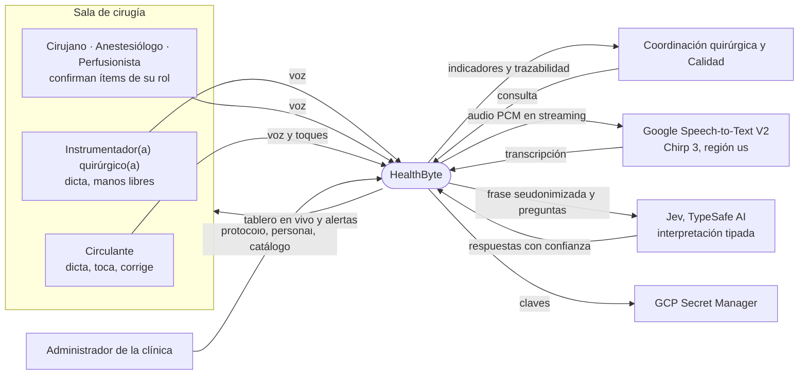

### 2.2 Funciones del producto

| Módulo | Función principal |
| --- | --- |
| Acceso y multi-clínica | Login por clínica, sesión firmada y aislamiento de datos entre clínicas. |
| Protocolo configurable | Define por clínica y especialidad los campos, fases, materiales, hitos y rangos. |
| Sesión en vivo | Tablero de una cirugía en uno o varios dispositivos, sincronizado en tiempo real. |
| Voz | Captura, transcripción, interpretación y registro de frases dictadas. |
| Registro manual | Respaldo táctil de todo lo que se puede dictar, y deshacer. |
| Paciente y datos preoperatorios | Identificación, datos del protocolo, completitud y rangos clínicos. |
| Equipo quirúrgico | Equipo programado, presentes y rol que confirma cada verificación. |
| Lista de verificación | Las tres fases de la OMS con sus ítems. |
| Tiempos | Las 5 horas del procedimiento, hitos, mediciones y duraciones. |
| Conteo de material | Entradas, salidas, balance y protocolo ante descuadre. |
| Registro del procedimiento | Las casillas Sí/No del tablero y el destino postoperatorio. |
| Control de consumos | Insumos, suturas, insumos con código y equipos especiales usados. |
| Alertas | Reglas que detectan riesgos y su cierre justificado. |
| Novedades | Incidentes con su ciclo de vida. |
| Trazabilidad | Línea de tiempo inmutable de cada cirugía. |
| Panel de gestión | Indicadores de seguridad, cumplimiento y tiempos por clínica. |

### 2.3 Características de los usuarios

| Usuario | Perfil | Uso del sistema | Restricción clave |
| --- | --- | --- | --- |
| **Instrumentador(a) quirúrgico(a)** | Profesional; conoce el protocolo, el conteo y el instrumental. Experiencia técnica variable. | Dicta conteos, hitos y verificaciones. | Está en campo estéril: **no puede tocar ningún dispositivo**. |
| **Circulante** (auxiliar de enfermería) | Técnico o profesional; maneja el tablero físico hoy. | Dicta, marca presentes, corrige y registra a mano. Inicia la sesión en el dispositivo de la sala. | Atiende varias tareas a la vez; necesita acciones de un toque. |
| **Cirujano, anestesiólogo, perfusionista** | Especialistas. | Confirman por voz los ítems de su rol. | No deben desviar la atención del paciente. |
| **Coordinación quirúrgica y Calidad** | Jefatura de enfermería, auditoría. | Consulta el panel y la trazabilidad. | Usa computador de escritorio; no está en la sala. |
| **Administrador de la clínica** | Personal de sistemas o calidad. | Configura protocolo, personal, quirófanos y catálogo. | Sin conocimientos de programación. |

### 2.4 Restricciones generales

| Id | Restricción | Fuente |
| --- | --- | --- |
| RG-01 | Prototipo funcional construido en 24 a 48 horas. | [SPEC] §1 |
| RG-02 | Solo datos ficticios. Ningún dato real de pacientes en el repositorio, la demo ni las diapositivas. | [L1581], [FIS] |
| RG-03 | Stack: TypeScript, React con Vite en el front, Node 24 con Fastify en el API, PostgreSQL 16. Sin Next.js. | [SPEC] §1 |
| RG-04 | Nube: GCP en la cuenta personal del equipo, región `us-east1`; Chirp 3 en la región `us`. Infraestructura con Terraform. | [SPEC] §11 |
| RG-05 | Presupuesto de nube de US$25, con alertas al 50 %, 90 % y 100 %. | [SPEC] §11 |
| RG-06 | Una sola instancia del API: la sincronización en vivo se hace en memoria. | [SPEC] §3 |
| RG-07 | Interfaz, nombres de código y mensajes en español. | AGENTS.md |
| RG-08 | Las alertas nunca bloquean el acto clínico. | [SPEC] §1 |

### 2.5 Supuestos y dependencias

| Id | Supuesto o dependencia | Si no se cumple |
| --- | --- | --- |
| SD-01 | La sala tiene una pantalla con navegador Chrome con acceso al micrófono (TV con mini-PC o portátil por HDMI). Las smart TV con navegador propio casi nunca lo permiten. | Se usa tablet o portátil. |
| SD-02 | Hay un micrófono USB o Bluetooth cerca del campo quirúrgico. | Baja la precisión de la transcripción. |
| SD-03 | La sala tiene conexión a internet estable durante la cirugía. | El sistema no funciona: el modo sin conexión está fuera de alcance. |
| SD-04 | Jev (en beta) y Chirp 3 están disponibles y sus precios son los públicos de octubre de 2026. | Registro manual; costos por recalcular. |
| SD-05 | Las cirugías, pacientes y equipos llegan sembrados: no hay formulario de programación. | — |
| SD-06 | La usuaria experta valida el vocabulario y los pendientes del [Apéndice B](#apéndice-b-pendientes-por-confirmar-tbd). | Los nombres de campos pueden no coincidir con los de la IPS. |

### 2.6 Distribución de requisitos por versión

| Versión | Contenido |
| --- | --- |
| **Demo de la hackathon (P0)** | Sesión en vivo, voz completa, checklist, conteo con alerta, horas, alertas con cierre, registro manual y deshacer, multi-clínica con RLS, login, siembra, despliegue en GCP. |
| **Demo ampliada (P1)** | Panel de gestión y trazabilidad, registro del procedimiento (Sí/No y destino), control de consumos básico. |
| **Producto (P2)** | Alta de clínica en vivo, exportación a PDF de la cirugía y del formato de consumos, analítica de consumos. |

---

## 3. Requisitos específicos

### 3.1 Interfaces externas

#### 3.1.1 Interfaces de usuario

| Id | Requisito | Prior. | Fuente | Verif. | Estado |
| --- | --- | --- | --- | --- | --- |
| RF-UI-01 | El sistema deberá ofrecer una **vista de sesión** de la cirugía con: paciente, procedimiento y lateralidad en grande; datos preoperatorios con marca de faltantes; equipo con presentes; fase actual del checklist; las 5 horas; conteo con balance; bitácora; alertas abiertas en rojo; transcripción en vivo; último registro; confirmación pendiente; botones de deshacer y registrar a mano. | P0 | [SPEC] §2.1 | D | Pendiente |
| RF-UI-02 | La vista de sesión deberá adaptarse al dispositivo: en pantalla grande prioriza la lectura a distancia con controles discretos; en tablet muestra controles táctiles. | P0 | [SPEC] §2.1 | D | Pendiente |
| RF-UI-03 | El sistema deberá ofrecer un **panel de gestión** por clínica, una **vista de trazabilidad** por cirugía y una pantalla de **login**. | P1 | [DIS] §8 | D | Pendiente |
| RF-UI-04 | La barra de voz deberá mostrar a Conti, la mascota, con un estado por cada fase de la frase: escuchando, procesando, registrado, ignorado y no entendido. | P1 | [PLAN] Ola 2 | P | Parcial |
| RF-UI-05 | Los colores, tipografías y pantallas deberán seguir el documento de diseño. Si contradice este SRS, prevalece este SRS. | P1 | [DIS] | I | Pendiente |

#### 3.1.2 Interfaces de hardware

| Id | Requisito | Prior. | Fuente | Verif. | Estado |
| --- | --- | --- | --- | --- | --- |
| RF-HW-01 | El sistema deberá funcionar en cualquier dispositivo con Chrome actual: TV con mini-PC, portátil o tablet. | P0 | [SPEC] §1 | D | Pendiente |
| RF-HW-02 | El sistema deberá capturar audio de un micrófono USB, Bluetooth o integrado mediante la API de medios del navegador. | P0 | [SPEC] §2.1 | D | Hecho |

#### 3.1.3 Interfaces de software

| Id | Requisito | Prior. | Fuente | Verif. | Estado |
| --- | --- | --- | --- | --- | --- |
| RF-SW-01 | El API deberá transcribir con Google Speech-to-Text V2: modelo `chirp_3`, idioma `es-US`, región `us`, audio `LINEAR16` a 16 kHz mono, puntuación automática, reducción de ruido, resultados parciales y adaptación en línea con hasta 1.000 frases del protocolo. | P0 | [SPEC] §4 | P | Parcial |
| RF-SW-02 | El API deberá interpretar con Jev (`POST https://api.typesafe.ai/v1/systemone`, modelo `jev-latest`) con un límite de 2 s y un reintento ante error 429, error 5xx o tiempo agotado. | P0 | [SPEC] §4, §9 | P | Hecho |
| RF-SW-03 | El API deberá persistir en PostgreSQL 16 con un rol de aplicación (`healthbyte_app`) que no es dueño de las tablas y no puede saltarse RLS. | P0 | [SPEC] §5 | P | Hecho |
| RF-SW-04 | El API deberá leer la clave de Jev y la contraseña de la base desde GCP Secret Manager. | P0 | [SPEC] §10 | I | Hecho |

#### 3.1.4 Interfaces de comunicación

| Id | Requisito | Prior. | Fuente | Verif. | Estado |
| --- | --- | --- | --- | --- | --- |
| RF-COM-01 | El API deberá exponer estas rutas REST, todas con sesión salvo las dos primeras: `GET /api/salud`, `POST /api/login`, `POST /api/logout`, `GET /api/yo`, `GET /api/cirugias`, `GET /api/cirugias/:id`, `GET /api/personal`, `POST /api/demo/reiniciar`. | P0 | [PLAN] T6 | P | Hecho |
| RF-COM-02 | El API deberá exponer un WebSocket en `/api/ws`. El cliente envía `unirse`, `registrar`, `confirmar`, `deshacer`, `tomar_microfono`, `soltar_microfono` y audio binario. El servidor envía `estado` (completo), `parcial`, `voz` y `aviso`. Los tipos son los de [CONTRATO]. | P0 | [SPEC] §3.1 | P | Hecho |
| RF-COM-03 | El servicio `web` deberá servir el front y hacer de proxy de `/api` y del WebSocket hacia `api`, para que todo salga del mismo origen. | P0 | [SPEC] §11 | D | Hecho |
| RF-COM-04 | Toda comunicación con el navegador deberá ir cifrada con HTTPS y WSS. | P0 | [SPEC] §10 | I | Hecho (Cloud Run) |

### 3.2 Requisitos funcionales

#### 3.2.1 Acceso y multi-clínica (AUT)

| Id | Requisito | Prior. | Fuente | Verif. | Estado |
| --- | --- | --- | --- | --- | --- |
| RF-AUT-01 | El sistema deberá permitir el inicio de sesión con clínica, usuario y clave. | P0 | [SPEC] §10 | P | Hecho |
| RF-AUT-02 | La sesión deberá guardarse en una cookie firmada `httpOnly`, `SameSite=Lax` y `secure` en producción, con el usuario, la clínica, el rol y el nombre. | P0 | [SPEC] §10 | P | Hecho |
| RF-AUT-03 | El sistema deberá responder 401 a toda ruta distinta de `/api/login` y `/api/salud` sin una sesión válida. | P0 | [SPEC] §10 | P | Hecho |
| RF-AUT-04 | Un usuario no deberá poder leer ni escribir datos de otra clínica. El aislamiento se aplica en la base de datos con RLS, no solo en el código. | P0 | [RETO], [SPEC] §5 | P | Hecho |
| RF-AUT-05 | Solo los roles coordinador y administrador deberán poder reiniciar los datos de la demo. | P0 | [PLAN] T6 | P | Hecho |
| RF-AUT-06 | El sistema deberá mostrar al iniciar sesión las cirugías activas de la clínica: quirófano, hora programada, paciente, procedimiento, especialidad y si está en curso. | P0 | [PLAN] T6 | P | Parcial |

#### 3.2.2 Protocolo configurable (PRO)

| Id | Requisito | Prior. | Fuente | Verif. | Estado |
| --- | --- | --- | --- | --- | --- |
| RF-PRO-01 | Cada clínica deberá tener un protocolo por especialidad con: campos preoperatorios (tipo, unidad, obligatorio, rango), fases con sus ítems (rol que confirma y si es crítico), materiales del conteo, hitos, mediciones (unidad y rango) y duraciones entre hitos. | P0 | [SPEC] §6 | P | Hecho |
| RF-PRO-02 | La pantalla, las preguntas a Jev y el vocabulario de Chirp 3 deberán derivarse del protocolo, de modo que una clínica o especialidad nueva no requiera cambios de código. | P0 | [SPEC] §6 | P | Parcial |
| RF-PRO-03 | El vocabulario para Chirp 3 deberá tener como máximo 1.000 frases, sin repetidas. | P0 | [SPEC] §4 | P | Hecho |
| RF-PRO-04 | Los nombres de campos y materiales deberán ser los impresos en el tablero de la IPS ([TAB]). | P0 | [SPEC] §6 | I | Hecho |
| RF-PRO-05 | El sistema podrá dar de alta una clínica nueva con su protocolo desde la interfaz. | P2 | [SPEC] §2.4 | D | Pendiente |

#### 3.2.3 Sesión en vivo (SES)

| Id | Requisito | Prior. | Fuente | Verif. | Estado |
| --- | --- | --- | --- | --- | --- |
| RF-SES-01 | El sistema deberá mantener una sala por cirugía. Varios dispositivos podrán abrir la misma cirugía y verán el mismo estado en tiempo real. | P0 | [SPEC] §3 | P | Hecho |
| RF-SES-02 | Después de cada cambio, el servidor deberá difundir el estado completo de la cirugía a todos los dispositivos de la sala. | P0 | [SPEC] §3 | P | Hecho |
| RF-SES-03 | Si se cae el WebSocket, el cliente deberá reconectarse con espera creciente (500 ms × 2ⁿ, máximo 10 s), volver a unirse y recibir el estado completo. | P0 | [SPEC] §9 | P | Hecho |
| RF-SES-04 | El estado de la cirugía deberá reconstruirse siempre a partir de sus eventos, de modo que una reconexión o un reinicio del API no pierdan información registrada. | P0 | [SPEC] §3.1 | P | Hecho |

#### 3.2.4 Voz e interpretación (VOZ)

| Id | Requisito | Prior. | Fuente | Verif. | Estado |
| --- | --- | --- | --- | --- | --- |
| RF-VOZ-01 | El navegador deberá capturar audio PCM de 16 bits a 16 kHz mono con un AudioWorklet. | P0 | [SPEC] §3 | P | Hecho |
| RF-VOZ-02 | El navegador deberá tener un detector de voz por volumen, con umbral ajustable en pantalla, y enviar audio en bloques de 100 ms **solo mientras alguien habla**. | P0 | [SPEC] §3 | P | Hecho |
| RF-VOZ-03 | Deberá haber **un solo micrófono activo por sesión**. El dispositivo que lo toma lo tiene; los demás muestran desde dónde se escucha. Si ese dispositivo se desconecta, el micrófono queda libre. | P0 | [SPEC] §2.1, §9 | P | Hecho |
| RF-VOZ-04 | El API deberá abrir el stream de Chirp 3 con la primera voz y cerrarlo tras 8 s de silencio o a los 4,5 minutos (límite de Google), y reabrirlo cuando vuelva la voz. | P0 | [SPEC] §3 | P | Hecho |
| RF-VOZ-05 | El sistema deberá difundir la transcripción parcial a todos los dispositivos mientras alguien habla. | P0 | [SPEC] §2.1 | P | Hecho |
| RF-VOZ-06 | El intérprete deberá convertir números en palabras a cifras («treinta y dos» → 32) y aceptar los que ya vienen en dígitos. | P0 | [SPEC] §4 | P | Hecho |
| RF-VOZ-07 | Antes de enviar texto a Jev, el sistema deberá **seudonimizar** el nombre del paciente (`[PACIENTE]`) y toda secuencia de 6 o más dígitos (`[ID]`). | P0 | [AC] §5, [L1581] | P | Hecho |
| RF-VOZ-08 | El intérprete deberá hacer **una sola llamada** a Jev con todas las preguntas: si la frase va dirigida al tablero, la intención, la hora, cada ítem de la fase actual, el material de cada par número + palabra, el movimiento, el hito, la medición y el campo. El estado enviado deberá ser mínimo: frase, fase actual con sus ítems y los 3 últimos eventos. | P0 | [SPEC] §4 | P | Hecho |
| RF-VOZ-09 | El sistema deberá decidir con umbrales: si `dirigida` < 0,5 o la intención < 0,6, ignora la frase y **no la guarda**; entre 0,6 y 0,85 deja una confirmación pendiente; con 0,85 o más registra de inmediato. Los umbrales viven en un solo archivo. | P0 | [SPEC] §4 | P | Hecho |
| RF-VOZ-10 | Una confirmación pendiente deberá aceptarse con un «sí» dictado o un toque, rechazarse con un «no», y vencer a los 15 s. | P0 | [SPEC] §4 | P | Hecho |
| RF-VOZ-11 | Una sola frase deberá poder confirmar varios ítems del checklist o registrar varios materiales («entran diez compresas y cinco gasas»). | P0 | [SPEC] §4 | P | Hecho |
| RF-VOZ-12 | Si Jev falla tras el reintento, la frase deberá mostrarse como «no interpretada» para asignarla con un toque. | P0 | [SPEC] §9 | P | Parcial |
| RF-VOZ-13 | Si se cae el stream de Chirp 3, deberá reabrirse solo y la pantalla mostrará «micrófono reconectando». | P0 | [SPEC] §9 | D | Parcial |
| RF-VOZ-14 | El sistema deberá incluir un script que pase el set de oro (≥ 40 frases dictadas por la instrumentadora, con su intención esperada) por el intérprete y reporte el acierto, para calibrar los umbrales. | P0 | [SPEC] §13 | P | Parcial (faltan las frases reales) |
| RF-VOZ-15 | El intérprete deberá conectarse al servidor de producción (hoy `server.ts` arranca sin voz). | P0 | [PLAN] T8, T10 | D | Pendiente |

#### 3.2.5 Registro manual y corrección (MAN)

| Id | Requisito | Prior. | Fuente | Verif. | Estado |
| --- | --- | --- | --- | --- | --- |
| RF-MAN-01 | Todo lo que se puede registrar por voz deberá poder registrarse con toques. Es el respaldo de toda falla de voz o de red hacia los servicios de IA. | P0 | [SPEC] §9 | D | Parcial |
| RF-MAN-02 | El API deberá validar cada registro que llega del navegador: tipo de evento conocido, campos obligatorios con su tipo, sin campos extra, textos no vacíos de máximo 500 caracteres y números finitos. Lo inválido se rechaza sin guardarse. | P0 | [PLAN] T7 | P | Hecho |
| RF-MAN-03 | **Deshacer** deberá anular el último evento vigente con un evento de tipo `anulacion`; nunca borra ni modifica el original. Se puede pedir por voz o con un toque. | P0 | [SPEC] §5 | P | Hecho |
| RF-MAN-04 | Deshacer podrá anular de una vez todos los eventos que generó una misma frase. | P2 | [PLAN] P2 | P | Pendiente |

#### 3.2.6 Paciente y datos preoperatorios (PAC)

| Id | Requisito | Prior. | Fuente | Verif. | Estado |
| --- | --- | --- | --- | --- | --- |
| RF-PAC-01 | El sistema deberá mostrar la identificación del paciente: nombre, tipo y número de documento, fecha de nacimiento y edad calculada, EPS e historia clínica. | P0 | [RETO] §3, [TAB] | D | Parcial |
| RF-PAC-02 | El sistema deberá mostrar el procedimiento, el diagnóstico y la lateralidad programados. | P0 | [RETO] §3, [TAB] | D | Parcial |
| RF-PAC-03 | El protocolo base deberá incluir los campos del tablero: Peso, Talla, Alergias, Sangre Grupo, RH, Tipo de Anestesia, Comorbilidades Asociadas, Condiciones Especiales y Aislamiento; y en cardiovascular además Reserva de Sangre y Cantidad y Glucometría. | P0 | [TAB], [RETO] §3 | P | Hecho |
| RF-PAC-04 | Al abrir la sesión, el sistema deberá marcar los campos obligatorios vacíos y mostrar un indicador de completitud (por ejemplo, 11/12). | P0 | [RETO] §3 | P | Parcial |
| RF-PAC-05 | Un dato preoperatorio deberá poder registrarse o corregirse por voz o a mano durante la sesión, como evento `dato`. | P0 | [SPEC] §5 | P | Hecho |
| RF-PAC-06 | Un campo o una medición con rango clínico deberá abrir una alerta crítica si su último valor sale del rango (glucometría: 70 a 250 mg/dl). | P0 | [AC] §3.1, [PLAN] T18 | P | Hecho |
| RF-PAC-07 | El sistema deberá registrar **Diagnóstico(s)** como lista, porque el tablero admite varios. | P1 | [TAB] | I | Nuevo |
| RF-PAC-08 | El sistema deberá separar la **reserva de sangre** (sí/no) de su **cantidad** en unidades, para validar que una reserva confirmada tenga cantidad. | P1 | [TAB], [SPEC] §2.5 | P | Nuevo |
| RF-PAC-09 | El sistema deberá registrar el campo **A/B** del tablero. Su significado y tipo están por confirmar (TBD-01). | P2 | [TAB] | I | Nuevo |

#### 3.2.7 Equipo quirúrgico (EQP)

| Id | Requisito | Prior. | Fuente | Verif. | Estado |
| --- | --- | --- | --- | --- | --- |
| RF-EQP-01 | Cada cirugía deberá traer su equipo programado por rol: cirujano, anestesiólogo, instrumentador, auxiliar de enfermería y perfusionista. | P0 | [RETO] §4 | P | Hecho |
| RF-EQP-02 | La circulante deberá poder marcar a cada integrante como presente; la marca queda como evento con la hora del servidor. | P0 | [SPEC] §1 | P | Hecho |
| RF-EQP-03 | Cada verificación del checklist deberá guardar el **rol que la confirma** según el protocolo y el **usuario de la sesión** que la registró, para responder «quién verificó». | P0 | [RETO] §4, §8 | P | Hecho |
| RF-EQP-04 | El sistema deberá registrar los roles adicionales del formato de consumos: instrumentador(a) 1 y 2, auxiliar 1 y 2, ayudantía general (sí/no), ayudantía especializada (sí/no) y pediatría. | P1 | [CON] | P | Nuevo |

#### 3.2.8 Lista de verificación de seguridad (CHK)

| Id | Requisito | Prior. | Fuente | Verif. | Estado |
| --- | --- | --- | --- | --- | --- |
| RF-CHK-01 | El checklist deberá tener tres fases: **antes de la anestesia** (abre con el ingreso y cierra antes de la anestesia), **antes de la incisión** (abre con la anestesia y cierra antes del inicio de la cirugía) y **antes de salir del quirófano** (abre con el fin de la cirugía y cierra antes de la salida a recuperación). | P0 | [RETO] §5, [OMS] | P | Hecho |
| RF-CHK-02 | La fase antes de la anestesia deberá incluir: identidad del paciente\*, procedimiento\*, sitio quirúrgico y lateralidad\*, alergias, riesgos relevantes, vía aérea difícil o riesgo de aspiración, riesgo de sangrado mayor a 500 ml y equipamiento disponible. (\* crítico) | P0 | [RETO] §5.1, [OMS] | P | Hecho |
| RF-CHK-03 | La fase antes de la incisión deberá incluir: confirmación del paciente, del procedimiento y del sitio y la lateralidad; identificación del equipo; indicadores de esterilización del instrumental\*; antibiótico profiláctico\*; riesgos previstos. | P0 | [RETO] §5.2, [AC] §3.1 | P | Hecho |
| RF-CHK-04 | La fase antes de salir deberá incluir: recuento de instrumental\*, recuento de gasas y material\*, identificación de muestras, registro de novedades y procedimiento realizado. | P0 | [RETO] §5.3 | P | Hecho |
| RF-CHK-05 | Cada ítem deberá aceptar los valores sí, no y no aplica, y mostrar quién lo confirmó (rol) y a qué hora. | P0 | [RETO] §8 | P | Hecho |
| RF-CHK-06 | La fase actual deberá calcularse sola a partir de las horas registradas. | P0 | [SPEC] §2.1 | P | Hecho |
| RF-CHK-07 | Una clínica podrá agregar ítems propios a su protocolo sin código (por ejemplo, marcación del sitio quirúrgico). | P1 | [SPEC] §6 | I | Hecho |

#### 3.2.9 Tiempos del procedimiento (TMP)

| Id | Requisito | Prior. | Fuente | Verif. | Estado |
| --- | --- | --- | --- | --- | --- |
| RF-TMP-01 | El sistema deberá registrar las 5 horas: ingreso, inicio de anestesia, inicio de cirugía, fin de cirugía y salida a recuperación. | P0 | [RETO] §6, [TAB] | P | Hecho |
| RF-TMP-02 | Cada hora deberá tomarse del **reloj del servidor** en el instante en que se dicta o se toca. La hora nunca se dicta ni se escribe. | P0 | [SPEC] §4 | P | Hecho |
| RF-TMP-03 | El sistema deberá registrar los hitos de la especialidad con su hora. Cardiovascular: heparina, entrada a bomba, salida de bomba, clamp aórtico, retiro de clamp y cardioplejía. Cirugía general: neumoperitoneo, extracción de pieza y cierre de aponeurosis. | P0 | [FIS] §9 | P | Hecho |
| RF-TMP-04 | El sistema deberá calcular las duraciones definidas en el protocolo (tiempo de bomba, tiempo de clamp). | P0 | [SPEC] §6 | P | Hecho |
| RF-TMP-05 | El sistema deberá registrar mediciones repetidas con su hora (glucometría en mg/dl, diuresis en cc). | P0 | [FIS] §9 | P | Hecho |
| RF-TMP-06 | Las horas del formato de consumos (entrada a quirófano, inicio de cirugía, fin de cirugía, salida de quirófano) deberán tomarse de las horas ya registradas, sin volver a digitarlas. | P1 | [CON] | P | Nuevo (TBD-07) |

#### 3.2.10 Conteo de material (CNT)

| Id | Requisito | Prior. | Fuente | Verif. | Estado |
| --- | --- | --- | --- | --- | --- |
| RF-CNT-01 | El sistema deberá registrar cada entrada (+) y salida (−) de material como evento y mostrar, por material, lo que entró, lo que salió y el balance. | P0 | [RETO] §5.3, [SPEC] §2.1 | P | Hecho |
| RF-CNT-02 | El catálogo de conteo deberá incluir los materiales del tablero: Compresas, Rollos Abdominales, Cotonoides, Gasas, Drenes, Mechas, Hiladillos, Agujas Sutura, Agujas Hipodérmicas, Hojas de Bisturí y **Torundas**. | P0 | [TAB] | I | Parcial (falta Torundas) |
| RF-CNT-03 | Al registrar el fin de la cirugía, todo material con balance distinto de cero deberá abrir una alerta crítica con lo que entró y lo que salió. | P0 | [RETO] §7 | P | Hecho |
| RF-CNT-04 | Ante un conteo descuadrado, el sistema deberá guiar el protocolo y registrar cada paso como evento: cirujano avisado, búsqueda en campo y radiografía intraoperatoria solicitada. | P0 | [AC] §3.1, [PLAN] Ola 2 | P | Hecho (API) |
| RF-CNT-05 | El sistema deberá registrar el **recuento de instrumental** del tablero. Si es un conteo por pieza o una verificación sí/no está por confirmar (TBD-02). | P1 | [TAB] | I | Nuevo |

#### 3.2.11 Registro del procedimiento (RPR)

| Id | Requisito | Prior. | Fuente | Verif. | Estado |
| --- | --- | --- | --- | --- | --- |
| RF-RPR-01 | El sistema deberá registrar las verificaciones Sí/No del tablero: Rayos X Intraoperatorios (con su identificador), Injertos, Muestra para Patología y Filtros Contenedor Instrumental. | P1 | [TAB] | P | Nuevo |
| RF-RPR-02 | Las casillas Chequeo Preoperatorio, Intraoperatorio y Postoperatorio deberán **derivarse** del estado de las fases del checklist en lugar de marcarse a mano, si se confirma que corresponden a ellas (TBD-03). | P1 | [TAB] | P | Nuevo |
| RF-RPR-03 | Al solicitar una radiografía en el protocolo de conteo (RF-CNT-04), la casilla Rayos X Intraoperatorios deberá quedar en «Sí». | P1 | [TAB], [AC] | P | Nuevo |
| RF-RPR-04 | La casilla Filtros Contenedor Instrumental deberá relacionarse con el ítem «Indicadores de esterilización del instrumental» del checklist, para no registrar dos veces lo mismo (TBD-04). | P1 | [TAB] | I | Nuevo |
| RF-RPR-05 | El sistema deberá registrar el **destino postoperatorio**: Hospitalización, UCI, Ambulatorio u Otros (con texto). | P1 | [TAB] | P | Nuevo |
| RF-RPR-06 | Si Muestra para Patología es «Sí», el ítem «Identificación de muestras» deberá ser obligatorio para cerrar la fase antes de salir; si falta, se abre una alerta. | P1 | [TAB], [RETO] §5.3 | P | Nuevo |

#### 3.2.12 Control de consumos de cirugía (CON)

Este módulo digitaliza el formato [CON], que hoy se llena aparte del tablero. El
principio es **registrar una sola vez**: lo que ya existe en la cirugía (paciente,
horas, equipo, procedimiento) se prellena, y el formato solo pide lo propio del consumo.

| Id | Requisito | Prior. | Fuente | Verif. | Estado |
| --- | --- | --- | --- | --- | --- |
| RF-CON-01 | El sistema deberá prellenar los **datos generales** del formato con los de la cirugía: fecha, nombre completo del paciente, número de documento, fecha de nacimiento y empresa (EPS). | P1 | [CON] | P | Nuevo |
| RF-CON-02 | El sistema deberá registrar los datos generales que hoy no existen: sexo (M/F), habitación, atención, plan y el campo «Paciente» del formato (TBD-05). | P1 | [CON] | P | Nuevo |
| RF-CON-03 | El sistema deberá prellenar los **datos de la cirugía**: quirófano, horas (RF-TMP-06), cirujano, especialidad, procedimiento, diagnóstico, instrumentadoras y auxiliares. | P1 | [CON] | P | Nuevo |
| RF-CON-04 | El sistema deberá registrar los datos de la cirugía que hoy no existen: paquete, número de vía, anestesia (tipo), patología (sí/no), laboratorio (sí/no) y congelación (sí/no). Patología deberá ser el mismo dato que Muestra para Patología del tablero (RF-RPR-01). | P1 | [CON] | P | Nuevo |
| RF-CON-05 | Cada clínica deberá tener un **catálogo de insumos** configurable sin código, agrupado como el formato: insumos generales, suturas, otros insumos e insumos con código. El catálogo inicial deberá ser el del formato [CON]. | P1 | [CON] | I | Nuevo |
| RF-CON-06 | Los renglones repetidos del formato (Guantes ×4, Hoja de bisturí ×2, Jeringa desechable ×2, Ethibond ×2, Monocryl ×2, Catgut cromado ×2) deberán modelarse como un solo insumo con variantes (talla, calibre o referencia), no como renglones duplicados (TBD-06). | P1 | [CON] | I | Nuevo |
| RF-CON-07 | El sistema deberá registrar el **consumo** de cada insumo (cantidad) por voz o con toques, como evento inmutable, y calcular el **total** por insumo. | P1 | [CON] | P | Nuevo |
| RF-CON-08 | Para los insumos con código (Hemoclip, Ligaclip, paquetes de artroscopia o desechables, renglones libres), el sistema deberá registrar además el **código** del elemento. | P1 | [CON] | P | Nuevo |
| RF-CON-09 | El sistema deberá permitir registrar un insumo no catalogado como «Otros», con nombre y cantidad. | P1 | [CON] | P | Nuevo |
| RF-CON-10 | El sistema deberá registrar los **equipos especiales** usados, con el catálogo del formato agrupado por especialidad: cirugía general, ginecología, ortopedia, neurocirugía, otorrino, urología y otros. Cada equipo se marca como usado. | P1 | [CON] | P | Nuevo |
| RF-CON-11 | El sistema deberá registrar quién cierra el formato (instrumentador(a) y auxiliar) con el usuario de la sesión y la hora del servidor, en lugar de la firma manuscrita. | P1 | [CON] | P | Nuevo |
| RF-CON-12 | Para los materiales que están a la vez en el conteo y en el consumo (gasas, cotonoides, mechas, hojas de bisturí), el sistema podrá **proponer** el consumo a partir de las entradas del conteo, y la persona lo confirma o corrige. | P2 | [TAB], [CON] | P | Nuevo |
| RF-CON-13 | El sistema podrá exportar el formato de consumos a PDF con la misma estructura del papel, para facturación. | P2 | [CON] | D | Nuevo |
| RF-CON-14 | El panel podrá mostrar el consumo por procedimiento, cirujano y periodo. | P2 | [RETO] §10 | D | Nuevo |

#### 3.2.13 Alertas (ALE)

| Id | Requisito | Prior. | Fuente | Verif. | Estado |
| --- | --- | --- | --- | --- | --- |
| RF-ALE-01 | Las alertas deberán ser funciones puras del estado de la cirugía, recalculadas con cada evento. Cada alerta tiene identificador, severidad (crítica o advertencia) y mensaje. | P0 | [SPEC] §7 | P | Hecho |
| RF-ALE-02 | El sistema deberá implementar al menos las reglas de la [tabla 3.2.13-A](#tabla-3213-a-reglas-de-alerta). | P0 | [RETO] §7 | P | Hecho |
| RF-ALE-03 | **Ninguna alerta deberá bloquear** un registro ni el acto clínico. | P0 | [SPEC] §1 | P | Hecho |
| RF-ALE-04 | Una alerta deberá quedar **resuelta** cuando su condición desaparece, o **cerrada con justificación** cuando se registra un `alerta_cierre` con motivo dictado o escrito. | P0 | [SPEC] §7 | P | Hecho |
| RF-ALE-05 | El sistema deberá conservar el historial de cada alerta: desde cuándo estuvo abierta, hasta cuándo, cómo se cerró y el motivo. | P0 | [RETO] §8 | P | Hecho |
| RF-ALE-06 | Las alertas abiertas deberán verse en rojo, con ícono y texto además del color, y con la acción sugerida. | P0 | [DIS] §3 | D | Pendiente |

##### Tabla 3.2.13-A Reglas de alerta

| Regla | Se dispara cuando | Severidad | Estado |
| --- | --- | --- | --- |
| Dato obligatorio vacío | Falta un campo preoperatorio obligatorio | Advertencia | Hecho |
| Ítem crítico pendiente | La fase ya abrió y un ítem crítico no está verificado (por ejemplo, antibiótico antes de la incisión) | Crítica | Hecho |
| Fase incompleta | Se registró la hora que cierra la fase y quedan ítems no críticos sin verificar | Advertencia | Hecho |
| Discrepancia con lo programado | Un ítem del checklist se responde «no» (paciente, procedimiento o sitio que no coinciden) | Crítica | Hecho |
| Alergia sin validar | Hay alergias registradas, la fase ya abrió y el ítem de alergias no está verificado | Crítica | Hecho |
| Conteo descuadrado | Se registró el fin de la cirugía y el balance de un material no es cero | Crítica | Hecho |
| Equipo distinto al programado | Tras el ingreso falta un integrante programado o hay un presente no programado | Advertencia | Hecho |
| Valor fuera de rango | El último valor de un campo o medición con rango sale de él (glucometría < 70 o > 250 mg/dl) | Crítica | Hecho |
| Antibiótico fuera de ventana | El antibiótico se verificó más de 60 min antes de la incisión | Advertencia | Hecho |
| Betalactámico con alergia a penicilina | Hay alergia a penicilina y se dicta un betalactámico al verificar el antibiótico | Crítica | Hecho |
| Reserva de sangre sin cantidad | La reserva es «sí» y no tiene cantidad (RF-PAC-08) | Advertencia | Nuevo |
| Muestra sin identificar | Muestra para Patología es «sí» y el ítem de muestras no está verificado (RF-RPR-06) | Crítica | Nuevo |

#### 3.2.14 Novedades (NOV)

| Id | Requisito | Prior. | Fuente | Verif. | Estado |
| --- | --- | --- | --- | --- | --- |
| RF-NOV-01 | El sistema deberá registrar una novedad con la transcripción literal y su hora; queda en estado **detectada**. | P0 | [RETO] §8 | P | Hecho |
| RF-NOV-02 | El sistema deberá registrar quién atiende la novedad (estado **atendida**) y las acciones realizadas al solucionarla (estado **solucionada**), con la hora de cada paso. | P0 | [RETO] §8 | P | Hecho |
| RF-NOV-03 | El único texto libre que se guarda deberá ser la transcripción de las novedades, de sus acciones y de los motivos de cierre de alertas. | P0 | [SPEC] §4 | I | Hecho |

#### 3.2.15 Trazabilidad (TRZ)

| Id | Requisito | Prior. | Fuente | Verif. | Estado |
| --- | --- | --- | --- | --- | --- |
| RF-TRZ-01 | Los eventos deberán ser **inmutables**: solo se insertan; la base de datos no concede `UPDATE` ni `DELETE` sobre ellos al rol de la aplicación. | P0 | [SPEC] §5 | P | Hecho |
| RF-TRZ-02 | Cada evento deberá guardar: hora del servidor, tipo, datos, usuario que registró, rol que confirma, origen (voz o manual), transcripción, confianza del intérprete y, si es una anulación, el evento anulado. | P0 | [SPEC] §5 | P | Hecho |
| RF-TRZ-03 | La vista de trazabilidad deberá mostrar la línea de tiempo de la cirugía (hora, evento, quién con nombre y rol, origen y detalle) y responder las preguntas del reto: quién verificó, a qué hora, qué se registró, qué quedó pendiente, qué novedad hubo, quién la atendió, cuándo se solucionó y qué se hizo. | P1 | [RETO] §8 | D | Pendiente |
| RF-TRZ-04 | La vista de trazabilidad podrá mostrar también los eventos anulados, marcados como tales. | P2 | [PLAN] P2 | D | Pendiente |
| RF-TRZ-05 | El sistema podrá exportar la cirugía completa a PDF. | P2 | [SPEC] §2.4 | D | Pendiente |

#### 3.2.16 Panel de gestión (PAN)

| Id | Requisito | Prior. | Fuente | Verif. | Estado |
| --- | --- | --- | --- | --- | --- |
| RF-PAN-01 | El panel deberá mostrar las cirugías programadas, en curso y realizadas de la clínica. | P1 | [RETO] §9 | P | Parcial |
| RF-PAN-02 | El panel deberá mostrar los checklists completos e incompletos de las cirugías realizadas. | P1 | [RETO] §9 | P | Parcial |
| RF-PAN-03 | El panel deberá mostrar el **cumplimiento del protocolo**: el porcentaje de cirugías en que cada fase se completó, sin respuestas «no», antes de registrar la hora que la cierra. | P1 | [SPEC] §8 | P | Parcial |
| RF-PAN-04 | El panel deberá mostrar las alertas abiertas, resueltas y cerradas con justificación, las más frecuentes, y los **riesgos atrapados** por categoría (datos completados, alergias validadas, compatibilidad de antibiótico, valores fuera de rango atendidos, discrepancias corregidas, conteos corregidos). | P1 | [SPEC] §8, [PLAN] Ola 2 | P | Parcial |
| RF-PAN-05 | El panel deberá mostrar el tiempo promedio por etapa (ingreso → anestesia, anestesia → incisión, cirugía, fin → salida) y las duraciones de la especialidad (bomba y clamp). | P1 | [RETO] §6 | P | Parcial |
| RF-PAN-06 | El panel deberá mostrar las novedades abiertas y solucionadas y el tiempo promedio hasta la solución. | P1 | [RETO] §9 | P | Parcial |
| RF-PAN-07 | El panel deberá listar las cirugías con fecha, quirófano, paciente, procedimiento, estado y alertas, y abrir la trazabilidad de cada una. | P1 | [RETO] §9 | D | Parcial |
| RF-PAN-08 | El panel deberá exponerse en una ruta del API (hoy el cálculo existe pero no tiene ruta). | P1 | [PLAN] T11 | P | Pendiente |
| RF-PAN-09 | El panel podrá mostrar **Quirófanos ahora**: cada sala con su procedimiento, etapa, avance del checklist, alertas y tiempo transcurrido. | P1 | [DIS] §8.3, [AC] §2 | D | Pendiente |
| RF-PAN-10 | El panel podrá filtrarse por periodo: hoy, semana y mes. | P1 | [DIS] §8.3 | D | Pendiente |

#### 3.2.17 Datos de demostración (DEM)

| Id | Requisito | Prior. | Fuente | Verif. | Estado |
| --- | --- | --- | --- | --- | --- |
| RF-DEM-01 | Al arrancar con la base vacía, el API deberá aplicar el esquema y sembrar dos clínicas ficticias con protocolos distintos, su personal, quirófanos y unas 60 cirugías históricas cada una, más la cirugía de la demo del día. | P0 | [SPEC] §2.3 | P | Hecho |
| RF-DEM-02 | Reiniciar la demo deberá archivar las cirugías del día y volver a sembrarlas sin tocar el historial. | P0 | [PLAN] T5 | P | Hecho |

### 3.3 Usabilidad

| Id | Requisito | Prior. | Fuente | Verif. | Estado |
| --- | --- | --- | --- | --- | --- |
| RNF-USA-01 | El instrumentador(a) en campo estéril deberá poder completar todos sus registros **sin tocar ningún dispositivo**. | P0 | [SPEC] §1 | D | Parcial |
| RNF-USA-02 | El sistema no deberá convertirse en un formulario: la entrada principal es la voz y la pantalla resume el estado. | P0 | [RETO] §2 | D | Parcial |
| RNF-USA-03 | Todo estado deberá comunicarse con ícono o palabra además del color (✓ completo, ! incompleto), porque el verde y el rojo de la marca tienen luminosidad parecida. | P0 | [DIS] §3 | I | Pendiente |
| RNF-USA-04 | El texto deberá cumplir un contraste mínimo de 4,5:1 (WCAG 2.1 AA, criterio 1.4.3). | P0 | [DIS] §3, [WCAG] | A | Pendiente |
| RNF-USA-05 | Los controles táctiles de la tablet deberán medir al menos 44 × 44 px (WCAG 2.1, criterio 2.5.5). | P1 | [WCAG] | I | Pendiente |
| RNF-USA-06 | La información principal de la vista de sesión (paciente, lateralidad, fase, alertas, conteo) deberá leerse a la distancia habitual entre el campo quirúrgico y la pantalla. La distancia y el tamaño mínimo de letra se fijan en el ensayo (TBD-08). | P0 | [SPEC] §2.1 | D | Pendiente |
| RNF-USA-07 | Toda acción manual frecuente (confirmar, deshacer, registrar conteo) deberá requerir como máximo dos toques. | P1 | [SPEC] §2.1 | D | Pendiente |

### 3.4 Desempeño

| Id | Requisito | Prior. | Fuente | Verif. | Estado |
| --- | --- | --- | --- | --- | --- |
| RNF-DES-01 | La interpretación con Jev deberá responder en 2 s o menos; si no, se reintenta una vez y luego se pasa a registro manual. | P0 | [SPEC] §9 | P | Hecho |
| RNF-DES-02 | Desde el fin de una frase hasta que el registro aparece en todos los dispositivos de la sala, el tiempo objetivo es de 3 s o menos en el percentil 90, a medir en la prueba de voz (TBD-09). | P1 | Propuesto | A | Pendiente |
| RNF-DES-03 | El estado difundido por WebSocket deberá ser el estado completo de una sola cirugía, que es pequeño, para que el cliente solo pinte. | P0 | [SPEC] §3 | I | Hecho |
| RNF-DES-04 | El sistema deberá soportar en la demo al menos dos clínicas, una cirugía en vivo con tres dispositivos conectados y el panel calculado sobre unas 120 cirugías. | P0 | [SPEC] §2.3 | D | Pendiente |
| RNF-DES-05 | El costo variable de voz por cirugía de 90 minutos no deberá superar US$1 con el detector de voz activo (estimado: US$0,58 de Chirp 3 + US$0,13 de Jev). | P1 | [SPEC] §15 | A | Pendiente |

### 3.5 Requisitos lógicos de la base de datos

| Id | Requisito | Prior. | Fuente | Verif. | Estado |
| --- | --- | --- | --- | --- | --- |
| RNF-BD-01 | Todas las tablas con datos de una clínica deberán llevar `clinica_id` y una política RLS `USING` y `WITH CHECK (clinica_id = current_setting('app.clinica_id'))`. El API fija la clínica con `SET LOCAL` en cada transacción. | P0 | [SPEC] §5 | P | Hecho |
| RNF-BD-02 | El esquema deberá ser idempotente: el API lo aplica en cada arranque sin perder datos. | P0 | [PLAN] T4 | P | Hecho |
| RNF-BD-03 | La hora de cada evento la pone la base (`clock_timestamp()`), nunca el cliente. | P0 | [SPEC] §5 | P | Hecho |
| RNF-BD-04 | Los datos de consumo deberán guardarse como eventos (`consumo`, `equipo_especial`, `cierre_consumo`) para heredar la inmutabilidad y la trazabilidad; el catálogo de insumos y de equipos especiales va en tablas por clínica con RLS. | P1 | Propuesto | I | Nuevo |

El modelo de datos está en la [sección 4.6](#46-modelo-de-datos).

### 3.6 Restricciones de diseño

| Id | Restricción | Fuente |
| --- | --- | --- |
| RD-01 | El contrato de tipos entre API y front vive en un solo archivo (`api/src/tipos.ts`). El front solo importa tipos, nunca código del API. | AGENTS.md |
| RD-02 | TypeScript sin compilar (Node 24 con *type stripping*): sin `enum`, sin `namespace`, sin propiedades en parámetros de constructor; imports relativos con extensión `.ts`. | AGENTS.md |
| RD-03 | No se agregan dependencias fuera de las declaradas. | AGENTS.md |
| RD-04 | Las cuentas (balances, duraciones, comparación de horas) las hace el código, nunca el modelo de IA. | [SPEC] §4 |
| RD-05 | Las preguntas y umbrales del intérprete viven en un solo archivo (`api/src/preguntas.ts`). | [SPEC] §3 |
| RD-06 | Una sola instancia del API. Para escalar a más de una, la difusión pasa a `LISTEN/NOTIFY` de Postgres o a Pub/Sub. | [SPEC] §3 |
| RD-07 | Terraform aborta si la cuenta autenticada de GCP no es la esperada. | [SPEC] §11 |

### 3.7 Atributos del sistema

#### 3.7.1 Confiabilidad y disponibilidad

| Id | Requisito | Prior. | Fuente | Verif. | Estado |
| --- | --- | --- | --- | --- | --- |
| RNF-CON-01 | El registro manual deberá estar siempre disponible, aunque fallen Chirp 3 o Jev. | P0 | [SPEC] §9 | D | Parcial |
| RNF-CON-02 | Una falla de voz o de interpretación nunca deberá guardar un evento: ante la duda, el sistema ignora o pregunta. | P0 | [SPEC] §4 | P | Hecho |
| RNF-CON-03 | El día de la demo, el API deberá tener una instancia mínima encendida para evitar el arranque en frío. | P0 | [SPEC] §11 | I | Hecho |
| RNF-CON-04 | La demo deberá tener un video de respaldo. | P0 | [SPEC] §13 | I | Pendiente |

#### 3.7.2 Seguridad de la información

| Id | Requisito | Prior. | Fuente | Verif. | Estado |
| --- | --- | --- | --- | --- | --- |
| RNF-SEG-01 | Las claves de usuario deberán guardarse con `scrypt` y sal aleatoria, y compararse en tiempo constante. | P0 | [PLAN] T6 | P | Hecho |
| RNF-SEG-02 | Los secretos (clave de Jev, contraseña de la base, secreto de sesión) no deberán estar en el repositorio ni en el estado de Terraform. | P0 | [SPEC] §10 | I | Hecho |
| RNF-SEG-03 | **El audio no deberá guardarse.** Tampoco la conversación que no va dirigida al tablero. | P0 | [SPEC] §10 | I | Hecho |
| RNF-SEG-04 | El texto que sale hacia servicios de terceros deberá ir seudonimizado (RF-VOZ-07). | P0 | [L1581] | P | Hecho |
| RNF-SEG-05 | La aplicación deberá conectarse a la base con un rol sin privilegios de dueño y sin `BYPASSRLS`. | P0 | [SPEC] §5 | P | Hecho |

#### 3.7.3 Mantenibilidad

| Id | Requisito | Prior. | Fuente | Verif. | Estado |
| --- | --- | --- | --- | --- | --- |
| RNF-MAN-01 | La lógica (estado, alertas, intérprete, números, seudonimización, panel, sesión, voz) deberá tener pruebas automatizadas que corren con `npm test`; las de base de datos con `npm run test:db`. | P0 | AGENTS.md | I | Hecho |
| RNF-MAN-02 | Una clínica nueva, una especialidad nueva o un ítem nuevo del checklist no deberán requerir cambios de código (RF-PRO-02). | P0 | [SPEC] §6 | D | Parcial |

#### 3.7.4 Portabilidad

| Id | Requisito | Prior. | Fuente | Verif. | Estado |
| --- | --- | --- | --- | --- | --- |
| RNF-POR-01 | API y front deberán empaquetarse como contenedores Docker, y la base de desarrollo correr con Docker Compose. | P0 | [PLAN] T16 | I | Hecho |
| RNF-POR-02 | La infraestructura completa deberá crearse y destruirse con Terraform; `terraform destroy` elimina el proyecto de GCP. | P0 | [SPEC] §11 | D | Hecho |

#### 3.7.5 Cumplimiento normativo

| Id | Requisito | Prior. | Fuente | Verif. | Estado |
| --- | --- | --- | --- | --- | --- |
| RNF-LEG-01 | El tratamiento de datos de pacientes deberá cumplir la Ley 1581 de 2012: datos de salud como sensibles, finalidad informada y seudonimización antes de transferir texto a terceros fuera del país. | P0 | [L1581] | A | Parcial |
| RNF-LEG-02 | La lista de verificación deberá mantener la lógica de la Lista OMS: tres momentos, ítems mínimos y responsable de cada uno. | P0 | [OMS], [RETO] §5 | I | Hecho |
| RNF-LEG-03 | Para que el registro pueda integrarse a la historia clínica, el sistema deberá conservar los eventos sin alteración y con autor y hora ([R1995]). La integración interoperable ([L2015]) queda fuera de esta versión. | P1 | [R1995], [L2015] | A | Parcial |
| RNF-LEG-04 | El producto deberá presentarse como **apoyo al registro y la trazabilidad, no como decisión clínica**. Su clasificación como dispositivo médico ante el INVIMA está por confirmar (TBD-10). | P0 | [D4725] | A | Pendiente |
| RNF-LEG-05 | Los indicadores del panel deberán poder alinearse con los de seguridad del paciente exigidos para la habilitación ([R3100]). | P2 | [R3100], [AC] §2 | A | Pendiente |

### 3.8 Fuera de alcance

Decisiones del equipo con su riesgo asumido, para que el jurado vea que se evaluaron.

| Exclusión | Motivo | Riesgo que queda | Fuente |
| --- | --- | --- | --- |
| Integración con la historia clínica | Tiempo de la hackathon | Doble registro en la IPS | [SPEC] §2.4 |
| Modo sin conexión | Complejidad de sincronización | Sin red, la sala queda sin tablero (SD-03) | [PLAN] Ola 2 |
| PIN personal y doble confirmación | Fricción en la sala; tiempo | Sin no repudio individual: `registrado_por` es quien inició sesión en el dispositivo | [PLAN] Ola 2, [AC] §3.2 |
| Bloqueo por inactividad | Tiempo | Dispositivo desatendido con sesión abierta | [PLAN] Ola 2 |
| Formulario para programar cirugías | Vienen sembradas | — | [SPEC] §2.4 |
| SSO o MFA | Tiempo | Autenticación básica | [SPEC] §2.4 |
| Datos reales de pacientes | Ley 1581 | — | RG-02 |

---

## 4. Modelos del sistema

### 4.1 Casos de uso

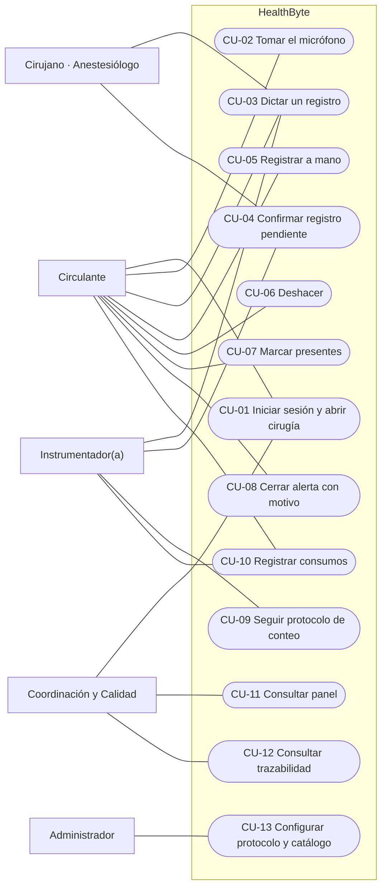

| CU | Actor principal | Flujo principal | Requisitos |
| --- | --- | --- | --- |
| CU-01 | Circulante | Inicia sesión con clínica, usuario y clave; elige la cirugía de la lista; el dispositivo se une a la sala y recibe el estado. | RF-AUT-01…06, RF-SES-01 |
| CU-02 | Circulante | Toca «Tomar micrófono»; los demás dispositivos muestran dónde se escucha. | RF-VOZ-03 |
| CU-03 | Instrumentador(a) | Dicta «entran diez compresas»; ve la transcripción, y el registro aparece con la hora en todos los dispositivos. | RF-VOZ-01…11 |
| CU-04 | Cualquiera en la sala | El sistema pregunta «¿Registrar Compresas +10?»; alguien dice «sí» o toca; vence a los 15 s. | RF-VOZ-10 |
| CU-05 | Circulante | Registra con toques una hora, un ítem, un conteo, un dato o una novedad. | RF-MAN-01, 02 |
| CU-06 | Circulante | Dice «deshacer» o toca; el último evento queda anulado. | RF-MAN-03 |
| CU-07 | Circulante | Marca a cada integrante presente al ingreso. | RF-EQP-02 |
| CU-08 | Circulante | Dicta el motivo para cerrar una alerta que no se va a resolver. | RF-ALE-04 |
| CU-09 | Instrumentador(a) | Ante el conteo descuadrado, sigue los pasos guiados hasta que el material aparece o se cierra con motivo. | RF-CNT-03, 04 |
| CU-10 | Instrumentador(a), Circulante | Registra consumos y equipos especiales; el formato se prellena con la cirugía. | RF-CON-01…11 |
| CU-11 | Coordinación | Consulta indicadores y la lista de cirugías. | RF-PAN-01…10 |
| CU-12 | Coordinación | Abre una cirugía y revisa su línea de tiempo. | RF-TRZ-03 |
| CU-13 | Administrador | Ajusta el protocolo, el personal y el catálogo de insumos. | RF-PRO-01, 05, RF-CON-05 |

### 4.2 Arquitectura de componentes

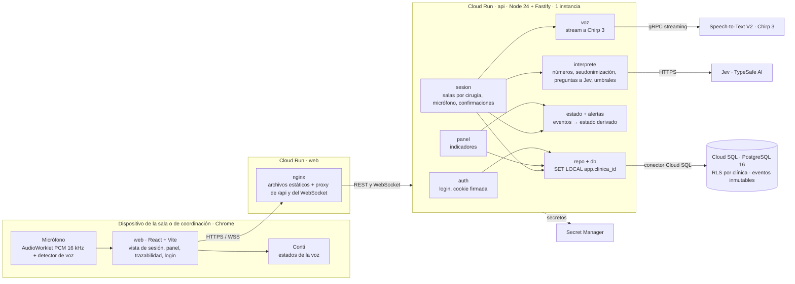

| Componente | Responsabilidad | Requisitos |
| --- | --- | --- |
| `web` | Vistas, captura de micrófono, detector de voz, reconexión. | RF-UI-*, RF-VOZ-01, 02, RF-SES-03 |
| `api/auth` | Login, sesión firmada, control de acceso. | RF-AUT-* |
| `api/sesion` | Salas, difusión del estado, micrófono único, confirmaciones, validación de entrada. | RF-SES-*, RF-VOZ-03, 10, RF-MAN-02, 03 |
| `api/voz` | Stream a Chirp 3, cierre por silencio o duración. | RF-SW-01, RF-VOZ-04, 05 |
| `api/interprete` | Frase → decisión tipada. | RF-VOZ-06…09, 11 |
| `api/estado` + `api/alertas` | Estado derivado y reglas de alerta. | RF-CHK-*, RF-CNT-*, RF-TMP-*, RF-ALE-*, RF-NOV-* |
| `api/panel` | Indicadores. | RF-PAN-* |
| `db` | Esquema, RLS, inmutabilidad. | RNF-BD-*, RF-TRZ-01 |

### 4.3 Despliegue

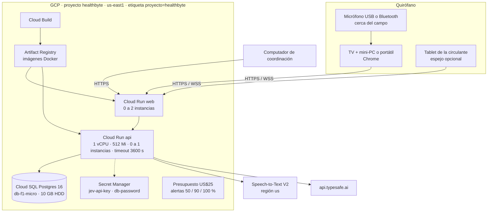

### 4.4 Comportamiento: flujo de una frase dictada

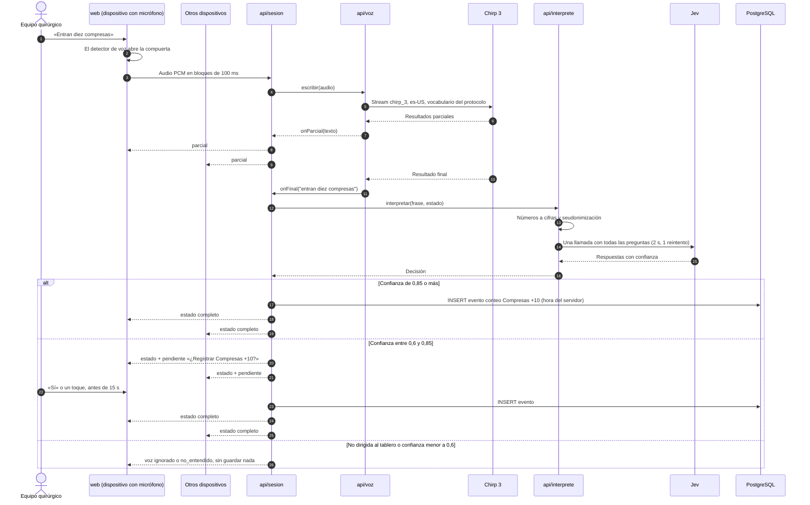

### 4.5 Comportamiento: decisión del intérprete

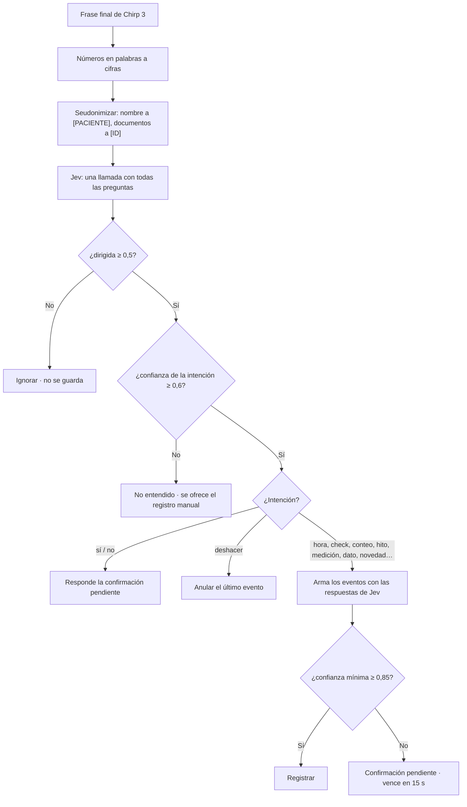

### 4.6 Modelo de datos

Las tablas y columnas marcadas como *propuesto* corresponden al módulo de consumos
(RF-CON) y a los campos nuevos del tablero; no existen todavía en `db/schema.sql`.

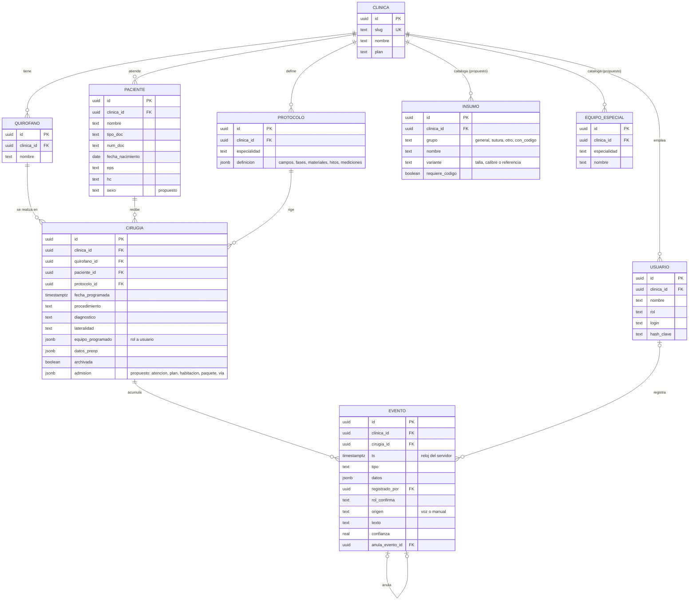

**Tipos de evento.** Los actuales están en [CONTRATO]. Se proponen cinco más:

| Tipo | Datos | Estado |
| --- | --- | --- |
| `hora`, `presente`, `check`, `conteo`, `hito`, `medicion`, `dato`, `novedad`, `novedad_atendida`, `novedad_solucionada`, `alerta_cierre`, `accion_conteo`, `anulacion` | Ver [CONTRATO] | Hecho |
| `verificacion` | casilla del tablero (rayos_x, injertos, patologia, filtros_contenedor), valor sí/no, identificador opcional | Nuevo (RF-RPR-01) |
| `destino` | hospitalizacion, uci, ambulatorio u otros, con texto | Nuevo (RF-RPR-05) |
| `consumo` | insumo_id o nombre libre, cantidad, código opcional | Nuevo (RF-CON-07…09) |
| `equipo_especial` | equipo_id | Nuevo (RF-CON-10) |
| `cierre_consumo` | instrumentador(a) y auxiliar responsables | Nuevo (RF-CON-11) |

### 4.7 Estados

**Ciclo de vida de una cirugía.** Las horas registradas mueven la cirugía entre fases;
cada fase del checklist abre con una hora y cierra antes de la siguiente.

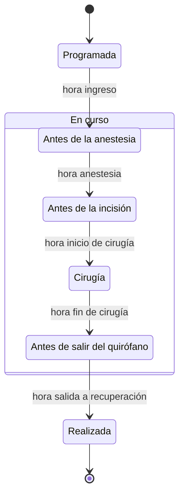

**Ciclo de vida de una alerta.**

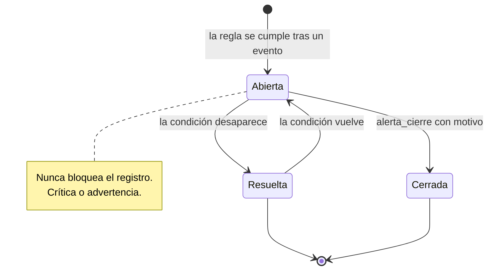

**Ciclo de vida de una novedad.**

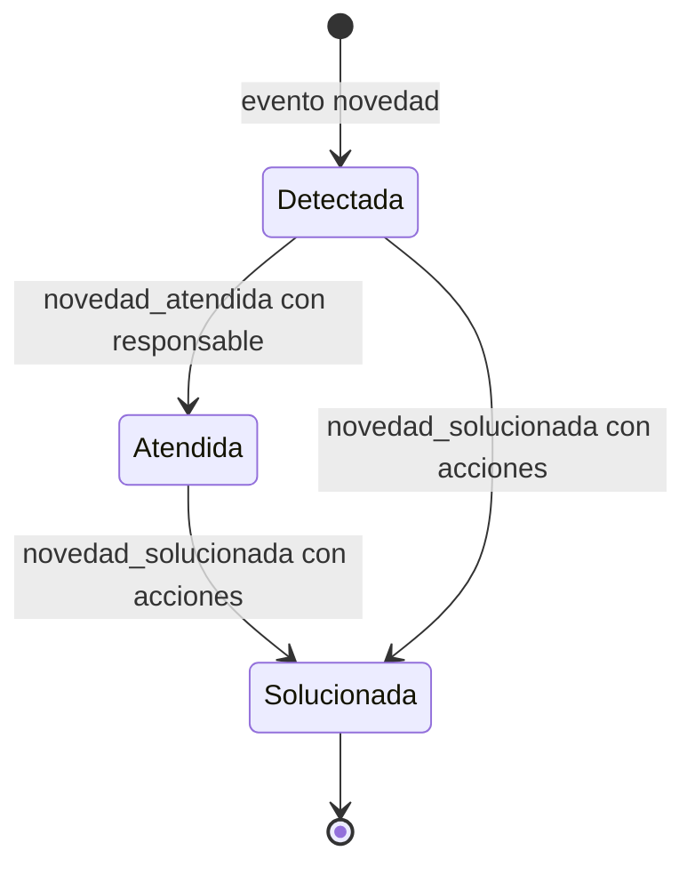

### 4.8 Actividad: conteo descuadrado

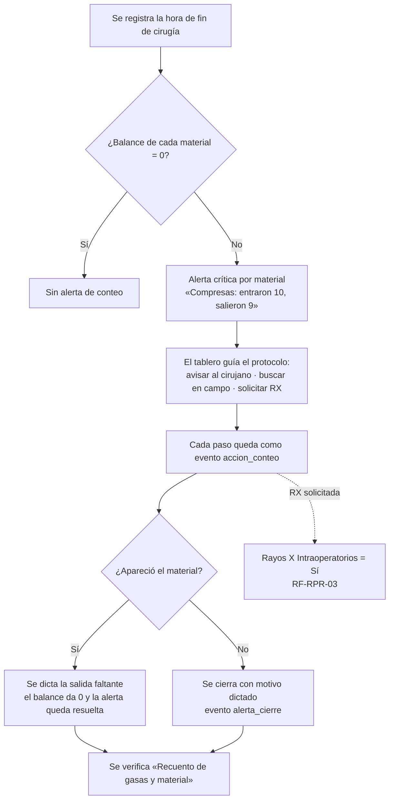

### 4.9 Actividad: formato de consumos

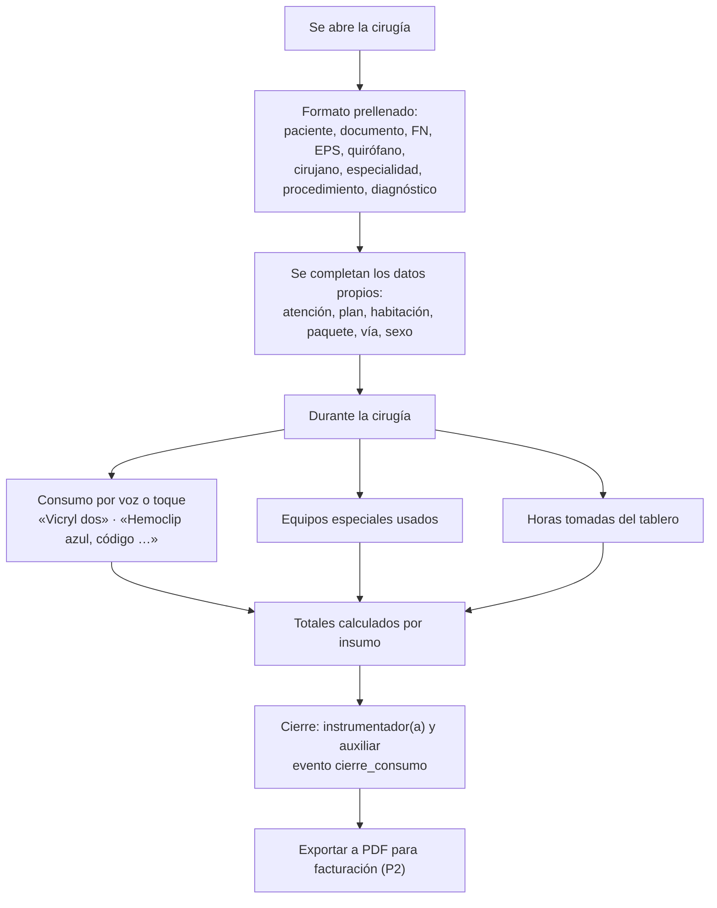

---

## 5. Verificación

### 5.1 Métodos

| Método | Cómo se aplica |
| --- | --- |
| **P** Prueba | Pruebas automatizadas con `node --test`. Las de lógica corren con `npm test`; las que necesitan PostgreSQL, con `npm run test:db`. |
| **D** Demostración | El guion de la demo ([SPEC] §2.5) en el hospital simulado, de punta a punta. |
| **I** Inspección | Revisión del código, del esquema, de Terraform o de la pantalla contra el requisito. |
| **A** Análisis | Medición o cálculo: contraste de color, latencia, costos, revisión normativa. |

### 5.2 Pruebas existentes y lo que verifican

| Archivo de prueba | Requisitos que verifica |
| --- | --- |
| `api/src/estado.test.ts` | RF-SES-04, RF-CHK-05, 06, RF-CNT-01, RF-TMP-01…05, RF-MAN-03, RF-NOV-01, 02 |
| `api/src/alertas.test.ts` | RF-ALE-01…05, RF-PAC-06, RF-CNT-03 y todas las reglas hechas de la tabla 3.2.13-A |
| `api/src/sesion.test.ts` | RF-AUT-04, RF-SES-01, 02, RF-VOZ-03, 05, 10, RF-MAN-02, 03, RF-CNT-04 |
| `api/src/interprete.test.ts` | RF-VOZ-08, 09, 11 |
| `api/src/numeros.test.ts` | RF-VOZ-06 |
| `api/src/privacidad.test.ts` | RF-VOZ-07, RNF-SEG-04 |
| `api/src/jev.test.ts` | RF-SW-02, RNF-DES-01 |
| `api/src/voz.test.ts` | RF-SW-01, RF-VOZ-04 |
| `api/src/panel.test.ts` | RF-PAN-01…07 |
| `api/src/clave.test.ts` | RNF-SEG-01 |
| `api/src/rls.dbtest.ts` | RF-AUT-04, RNF-BD-01, RNF-SEG-05 |
| `api/src/app.dbtest.ts` | RF-AUT-01…03, 05, RF-COM-01 |
| `api/src/siembra.dbtest.ts` | RF-DEM-01, 02 |
| `web/src/pcm.test.ts` | RF-VOZ-01 |
| `web/src/estadoConti.test.ts` | RF-UI-04 |
| `npm run oro` (set de oro) | RF-VOZ-14 |

### 5.3 Pruebas por construir

| Prueba | Requisitos | Criterio de aceptación |
| --- | --- | --- |
| Set de oro con frases reales | RF-VOZ-09, 14 | ≥ 40 frases dictadas por la instrumentadora. Ninguna frase de conversación se registra sola; el acierto de intención se reporta y fija los umbrales. |
| Prueba de voz con ruido real | RNF-DES-02, 05 | 10 frases en el hospital simulado. Se miden la latencia frase → registro y el porcentaje del tiempo con voz. |
| Ensayo de la demo | RF-UI-01, RNF-USA-01, 06 | El guion completo sin tocar el dispositivo desde el campo, leído a la distancia real. |
| Consumos | RF-CON-* | Un formato completo de una cirugía de prueba coincide renglón por renglón con el papel diligenciado en paralelo. |
| Accesibilidad | RNF-USA-03…05 | Revisión de contraste y tamaños con una herramienta de auditoría del navegador. |

---

## 6. Apéndices

### Apéndice A. Trazabilidad de los formatos a los requisitos

#### A.1 Tablero quirúrgico ([TAB])

| Campo del formato | Dónde queda en el sistema | Requisito | Estado |
| --- | --- | --- | --- |
| Hora Ingreso, Anestesia, Inicio Cirugía, Final Cirugía | Evento `hora` (más salida a recuperación, que pide el reto) | RF-TMP-01, 02 | Hecho |
| Paciente | `paciente.nombre` | RF-PAC-01 | Hecho |
| Cirujano, Anestesiólogo | `cirugia.equipo_programado` + evento `presente` | RF-EQP-01, 02 | Hecho |
| Procedimiento | `cirugia.procedimiento` + ítems del checklist | RF-PAC-02, RF-CHK-02 | Hecho |
| Tipo de Anestesia | Campo preoperatorio `tipo_anestesia` | RF-PAC-03 | Hecho |
| Diagnóstico(s) | `cirugia.diagnostico` (uno) | RF-PAC-07 | Nuevo (lista) |
| Comorbilidades Asociadas | Campo `comorbilidades` | RF-PAC-03 | Hecho |
| Lateralidad: Derecha / Izquierda | `cirugia.lateralidad` + ítem «Sitio quirúrgico y lateralidad» | RF-PAC-02, RF-CHK-02 | Hecho |
| Aislamiento, Condiciones Especiales, Alergias | Campos del protocolo | RF-PAC-03 | Hecho |
| FN, Edad | `paciente.fecha_nacimiento`; la edad se calcula | RF-PAC-01 | Hecho |
| A/B | — | RF-PAC-09 | Nuevo (TBD-01) |
| Peso | Campo `peso` | RF-PAC-03 | Hecho |
| Sangre Grupo, RH | Campos `grupo_sanguineo`, `rh` | RF-PAC-03 | Hecho |
| Reserva de Sangre y Cantidad | Campo `reserva_sangre` (texto) | RF-PAC-08 | Parcial |
| Rayos X Intraoperatorios Sí/No (ID) | Evento `verificacion` | RF-RPR-01, 03 | Nuevo |
| Injertos Sí/No | Evento `verificacion` | RF-RPR-01 | Nuevo |
| Chequeo Pre-, Intra- y Postoperatorio Sí/No | Derivado de las fases del checklist | RF-RPR-02 | Nuevo (TBD-03) |
| Muestra para Patología Sí/No | Evento `verificacion` | RF-RPR-01, 06 | Nuevo |
| Filtros Contenedor Instrumental Sí/No | Ítem «Indicadores de esterilización» | RF-RPR-04 | Nuevo (TBD-04) |
| Recuento | Ítem «Recuento de instrumental» | RF-CNT-05 | Nuevo (TBD-02) |
| Compresas, Rollos Abdominales, Cotonoides, Gasas, Drenes, Mechas, Hiladillos, Agujas Sutura, Agujas Hipodérmicas, Hojas de Bisturí | Materiales del conteo | RF-CNT-01, 02 | Hecho |
| Torundas | Material del conteo | RF-CNT-02 | Nuevo |
| Destino: Hospitalización, UCI, Ambulatorio, Otros | Evento `destino` | RF-RPR-05 | Nuevo |

#### A.2 Control de consumos ([CON])

| Sección del formato | Dónde queda en el sistema | Requisito | Estado |
| --- | --- | --- | --- |
| Fecha, nombre, documento, fecha de nacimiento, empresa | Prellenado desde `paciente` y `cirugia` | RF-CON-01 | Nuevo |
| Atención, plan, paciente, sexo, habitación | `paciente.sexo`, `cirugia.admision` | RF-CON-02 | Nuevo (TBD-05) |
| Quirófano, cirujano, especialidad, procedimiento, diagnóstico | Prellenado desde `cirugia` y `protocolo` | RF-CON-03 | Nuevo |
| Horas de entrada, inicio, fin y salida | Eventos `hora` | RF-TMP-06 | Nuevo (TBD-07) |
| Paquete, No. Vía | `cirugia.admision` | RF-CON-04 | Nuevo |
| Ayudantía general y especializada, Instrumentadora 1 y 2, Auxiliar 1 y 2, Pediatría | Equipo de la cirugía | RF-EQP-04 | Nuevo |
| Anestesia, Patología, Laboratorio, Congelación | Datos de la cirugía; Patología = Muestra para Patología | RF-CON-04 | Nuevo |
| Insumos generales, suturas, otros insumos (Consumo y Total) | Catálogo `INSUMO` + eventos `consumo` | RF-CON-05…07, 09 | Nuevo |
| Insumos con código (Consumo, Elemento, Código, Total) | Eventos `consumo` con código | RF-CON-08 | Nuevo |
| Equipos especiales por especialidad | Catálogo `EQUIPO_ESPECIAL` + eventos `equipo_especial` | RF-CON-10 | Nuevo |
| Firma de instrumentador(a) y auxiliar | Evento `cierre_consumo` | RF-CON-11 | Nuevo |

#### A.3 Reto oficial ([RETO])

| Sección del reto | Requisitos |
| --- | --- |
| §3 Identificación y preparación del paciente | RF-PAC-01…09, RF-ALE-02 |
| §4 Identificación del equipo | RF-EQP-01…04 |
| §5 Lista de verificación | RF-CHK-01…07, RNF-LEG-02 |
| §6 Tiempos | RF-TMP-01…06, RF-PAN-05 |
| §7 Alertas y riesgos | RF-ALE-01…06, RF-CNT-03, 04 |
| §8 Trazabilidad | RF-TRZ-01…05, RF-NOV-01…03, RF-EQP-03 |
| §9 Panel de gestión | RF-PAN-01…10 |
| §10 IA y analítica | RF-VOZ-01…15, RF-CON-14 |

### Apéndice B. Pendientes por confirmar (TBD)

Preguntas para la usuaria experta de Instrumentación Quirúrgica. Cada respuesta puede
cambiar los requisitos indicados.

| Id | Pregunta | Afecta a |
| --- | --- | --- |
| TBD-01 | ¿Qué significa **A/B** en el bloque FN / Edad / A/B / Peso, y qué valores lleva? | RF-PAC-09 |
| TBD-02 | La fila **Recuento** del tablero, ¿es el recuento de instrumental? ¿Se anota un número o solo sí/no? | RF-CNT-05 |
| TBD-03 | **Chequeo Pre-, Intra- y Postoperatorio**, ¿corresponden a los tres momentos de la lista de verificación? Si es así, se derivan solos. | RF-RPR-02 |
| TBD-04 | **Filtros Contenedor Instrumental**, ¿se refiere a los filtros de los contenedores rígidos de esterilización? ¿Es lo mismo que verificar los indicadores de esterilización? | RF-RPR-04 |
| TBD-05 | En el formato de consumos, ¿qué son **Atención**, **Plan** y **Paciente** (distinto del nombre completo)? ¿Qué es **Paquete** y **No. Vía**? | RF-CON-02, 04 |
| TBD-06 | Los renglones repetidos (Guantes ×4, Ethibond ×2, Monocryl ×2, Catgut cromado ×2…), ¿son tallas o calibres distintos? ¿Cuáles? | RF-CON-06 |
| TBD-07 | ¿La **salida de quirófano** del formato de consumos es la misma hora que la **salida a recuperación** del tablero? | RF-TMP-06 |
| TBD-08 | ¿A qué distancia queda la pantalla del campo quirúrgico? ¿Dónde se pondría el micrófono? | RNF-USA-06, SD-01, SD-02 |
| TBD-09 | ¿Qué demora entre la frase y el registro le parece aceptable al equipo? | RNF-DES-02 |
| TBD-10 | Clasificación ante el INVIMA: ¿el producto es un dispositivo médico según el Decreto 4725 de 2005? | RNF-LEG-04 |
| TBD-11 | ¿Quién llena hoy el formato de consumos y en qué momento: durante la cirugía o al final? | RF-CON-07, 11 |
| TBD-12 | En el formato, ¿qué diferencia hay entre las columnas **Consumo** y **Total**? (Hipótesis: Consumo son las marcas de conteo y Total la suma.) | RF-CON-07 |
| TBD-13 | Las 40 frases del set de oro, tal como se dicen en el quirófano. | RF-VOZ-14 |

### Apéndice C. Resumen del estado

| Estado | Funcionales | No funcionales |
| --- | --- | --- |
| Hecho | La lógica central del API: acceso, multi-clínica, sesión en vivo, voz e intérprete, checklist, conteo, tiempos, alertas, novedades, trazabilidad inmutable y siembra. | Seguridad, base de datos, mantenibilidad y portabilidad. |
| Parcial | Lo que tiene lógica sin interfaz: vista de sesión, panel (sin ruta), registro manual en pantalla, voz sin conectar en `server.ts`. | Usabilidad manos libres, cumplimiento de la Ley 1581. |
| Pendiente | Front (tareas 12 a 15 del plan), trazabilidad en pantalla, exportaciones. | Accesibilidad, latencia medida, video de respaldo. |
| Nuevo | Registro del procedimiento (Sí/No y destino), Torundas, diagnósticos múltiples, reserva de sangre separada y todo el control de consumos. | Modelo de datos de consumos. |
